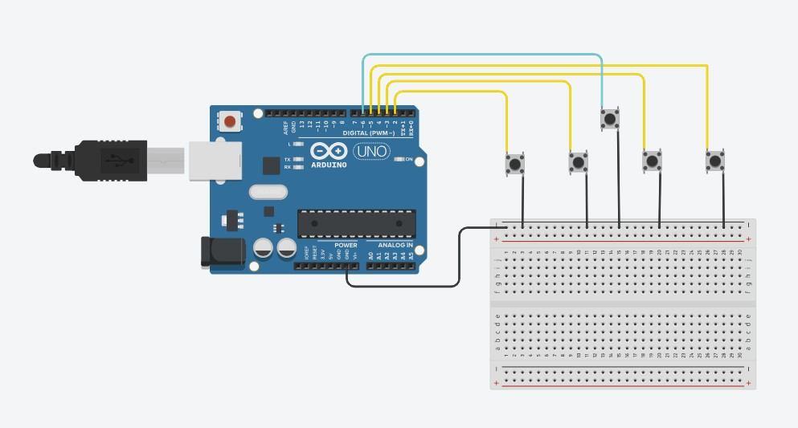
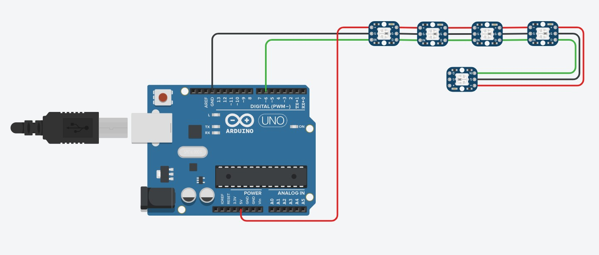
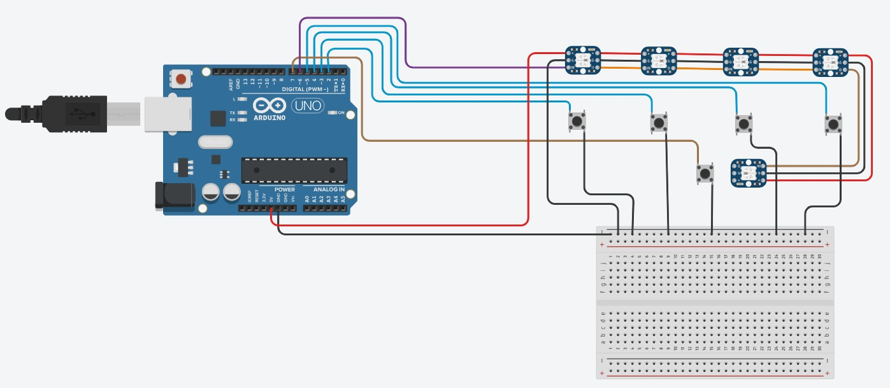

# Emerging tech - praktijk
## 1. Gekozen opdracht

   Deze opdracht is gelinkt aan het project gebruiksgericht ontwerpen. 
   
   Met behulp van een knop wordt het product bediend. Er wordt een willekeurige kleurencombinatie aangemaakt en er wordt telkens een woord naar de seriële monitor geprint. Hierdoor zal het scherm in protopie veranderen. Naast deze knop staat één neopixel, deze geeft aan dat de gebruiker de knop moet bedienen. Wanneer de combinatie is weergegeven zal de ene neopixel uitgaan en moeten vier andere knoppen ingedrukt worden in de juiste volgorde. Ook deze vier knoppen komen overeen met een neopixel. Deze 4 neopixels krijgen elk een kleur van de willekeurige combinatie. Wanneer de gebruiker gedaan heeft wordt de ingegeven combinatie vergeleken met de willekeurig aangemaakte combinatie. Als ze overeenkomen of niet zal geprint worden en zal met een scherm in protopie aangetoond worden. Na een druk op de hoofdknop start de loop opnieuw.

Hoe we tot de finale versie zijn geraakt hebben we vast gelegd in een verslag. Het document is hier te vinden. <a href="Verslag opkomende technologieën.pdf" target="_blank">Verslag (PDF)</a>

## 2. Afbeelding arduino schema

__Verificatie input__

__Verificatie output__

__Finale versie__

