# Intelight
*Het combineren van fysieke activiteit en cognitieve stimulatie die zowel het lichaam als de hersenen versterkt, wat helpt om geheugenverlies preventief tegen te gaan.*

*Projectteam: De Waele Briek; De Croo Nand*

18/06/2025
## Samenvatting
Veel mensen ervaren bij henzelf of rondom hen mentale achteruitgang naarmate ze ouder worden. Hierdoor ontstaan geheugenproblemen en een verminderende cognitieve functie. Dit is onderzocht aan de hand van literatuurstudie en interviews. De conclusie hieruit is dat het noodzakelijk is om tijdig preventieve maatregelen te gaan nemen om zo de hersenen actief te houden en geheugenverlies te vertragen. Een manier om dit te bereiken, is door het trainen van het geheugen met cognitieve oefeningen.  

De cognitieve oefening hiervoor is Intelight, een slimme console die gebruikers helpt hun geheugen te trainen door middel van interactieve kleurcombinatiespelletjes. De console stimuleert hersentraining waardoor het brein actief blijft en biedt verschillende denkoefeningen met verschillende moeilijkheidsniveaus, wat de doelgroep doet uitbreiden. 

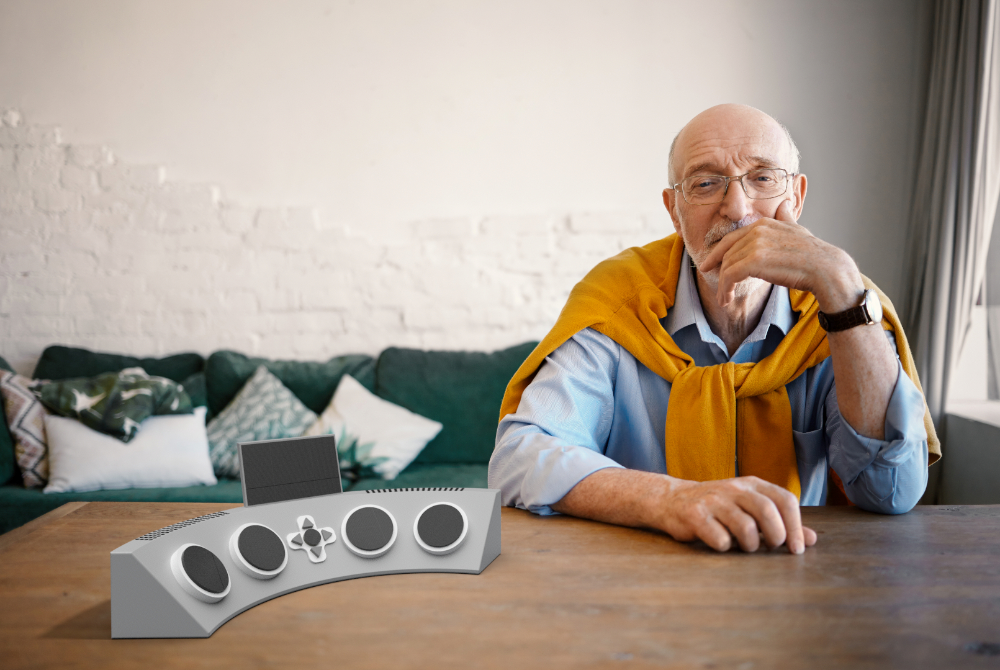

## Introductie
Het project is vetrokken uit de design challenge “Healthy Aging”, waarbij het ontwerpen van slimme producten die zorgen voor het gezond verouderen centraal staat.  

Doordat de bevolking steeds ouder wordt, neemt ook het aantal dementerenden toe [^1]. Met dit probleem wordt in dit project aan de slag gegaan om dit zo veel mogelijk te gaan beperken. 

Een techniek die hedendaags wordt gebruikt om cognitieve achteruitgang tegen te gaan is de Ronnie Gardiner Methode (RGM). Het is een multi-sensorische oefenmethode. Er wordt muziek en ritme ingezet om meerdere gebieden van de hersenen te stimuleren.

Het project is gebaseerd op het onthouden van één of meerdere combinaties. Hierbij wordt als combinatie kleuren gebruikt. Die kleuren worden getoond d.m.v. een scherm. Na de combinatie gezien te hebben moet de combinatie correct worden ingegeven d.m.v. gekleurde knoppen. De cognitieve oefening kan gespeeld worden op verschillende niveaus. Zo kan er gevarieerd worden met de visualisatie van de kleurencombinatie. De duur van elke kleur kan zo korter/langer zichtbaar gemaakt worden, of ze kiezen de duur door zelf het scherm te besturen. Ook kan er met de knoppen gevarieerd worden. Deze kunnen op voorhand of slechts een beperkte tijd zichtbaar zijn. Ook het aantal kleuren (= aantal knoppen) kan aangepast worden aan de gebruiker. Deze parameters zorgen ervoor dat elke gebruiker met deze cognitieve oefening wordt uitgedaagd. 

Door deze kleurcombinaties te gaan onthouden wordt het werkgeheugen en de visuele perceptie getraind en actief gehouden. Dit veroorzaakt de vertraging van de cognitieve achteruitgang van het brein. De belangrijkste randvoorwaarden hierbij zijn: 

* Gebruiksvriendelijk: De gebruikers moet zich comfortabel voelen tijdens de interactie met het product.
* Vermakelijk: De gebruiker mag zich niet vervelen.
* Aanpasbaar niveau: Het product openstellen voor mensen van verschillende niveaus om het uitsluiten van mensen te beperken.
* Veiligheid: De doelgroep zijn ouderen. Het is een kwetsbare groep. Scherpe randen vermijden.
## Methodologie
Als weergave van de methodologie werd een variant op de methode van de ‘Double Diamond’ toegepast. Deze methode laat toe om meerdere keren te divergeren en convergeren. Er wordt gewerkt in verschillende fases.

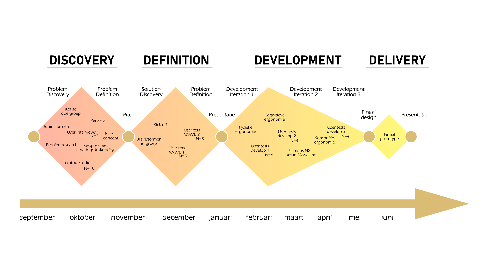

__Discovery__

Tijdens de discovery fase werd research gedaan naar het onderwerp en de doelgroep. Ook werd meer kennis opgedaan door interviews, met zowel de gebruiker als met 3 ervaringsdeskundigen, en een literatuurstudie. Hierdoor werd er divergerend gebrainstormd en konden ideeën ontwikkeld worden. De ideeën worden geconvergeerd tot een concept dat gepitcht wordt. 

__Definition__

In het begin van de definition fase wordt gedivergeerd om verschillende concepten te testen. In twee waves worden verschillende prototypes getest om het concept te valideren. Door de testen worden probleempunten duidelijk en kunnen conclusies getrokken worden.  Hierdoor wordt geconvergeerd naar 1 idee die wordt voorgesteld in het storyboard. Deze fase eindigt met de presentatie.

__Develop 1__

Tijdens de eerste development fase wordt de fysieke ergonomie van het product onderzocht. Hier wordt er aandacht besteed aan de vorm van het product. Er worden verschillende prototypes getest.

__Develop 2__

In de tweede development fase wordt de cognitieve ergonomie onder de loep genomen. Drie interfaces worden getest. Ook worden aanvullende tests uitgevoerd in verband met de fysieke ergonomie. Hiervoor wordt Siemens NX Human Modelling gebruikt.

__Develop 3__

Tijdens de derde development fase wordt de sensoriële ergonomie getest. Er worden testen gedaan i.v.m. LED's en knoppen. Hier worden de details verfijnd.

__Delivery__

Het finale design ligt vast en een prototype wordt uitgewerkt.

## 1.1 Discovery
### Doestellingen
Een belangrijke doelstelling is het bestuderen van het probleem, d.m.v. interviews en literatuur, om zo zicht te hebben op het probleem en een oplossing te gaan bedenken. 
### Materiaal & methoden
De gebruikte methodes waren: 

* __Interview met ervaringsdeskundige (N=3)__: Er worden interviews afgenomen met een ervaringsdeskundigen die diepgaande kennis heeft over de motoriek en het samenwerken van hersenhelften, om die zo te gaan stimuleren. Die expertise is handig om de context verder te verduidelijken en de informatie uit de interviews met de doelgroep te verrijken en te onderbouwen.

* __Literatuurstudie (N=10)__: Aan de hand van literatuurstudie wordt onderzocht welke activiteiten een impact hebben op cognitie. Er wordt onderzoek gedaan naar de Ronnie Gardiner Methode, maar ook naar de effecten van muziek, fysieke en cognitieve oefeningen op de hersenen.
### Resultaten
__Interview met ervaringsdeskundige__

Uit de interviews wordt afgeleid dat combinaties onthouden en reactie vermogen positieve reacties krijgt. Door dit te combineren met een fysieke beweging wordt een goede oefening gecreëerd die de hersenen stimuleren in verschillende gebieden. Het is ook belangrijk dat het product eenvoudig te gebruiken is, zeker als de gebruiker op leeftijd is.

__Literatuurstudie__ 

Uit de literatuurstudie blijkt dat door muziek, fysieke en cognitieve oefeningen te combineren worden de hersenen gestimuleerd in verschillende gebieden. Ook groepsactiviteiten hebben een positief effect, het zorgt voor een sociale verbondenheid en een vermindering van stress.
### Conclusies & implicaties

1. Het product moet de gebruiker fysiek aan het werk zetten.
2. Het concept moet de gebruiker cognitief genoeg uitdagen.
3. De interface moet eenvoudig te gebruiken zijn.
4. Het product kan door meerdere mensen tegelijk gebruikt worden.

## 1.2 Definition
Tijdens de definitiefase worden mogelijke oplossingen onderzocht en geëvalueerd om zo tot een concept te komen. Er wordt gewerkt in twee waves. Tijdens de eerste wave worden drie concepten getest. Uit deze concepten wordt één concept gekozen om in de tweede wave met verder te gaan.
### Doestellingen
* Storyboard 
* Quick-and-dirty prototypes 
* Concept bekomen 
* Concept valideren 
### Materiaal & methoden
* __WAVE 1 - Prototype 1:__ Het prototype is gemaakt uit hout om stevigheid te bieden en heeft een digitale interface met fysieke knoppen. De interface is gecreëerd met Protopie en een smartphone. De gebruiker krijgt een kleurencombinatie te zien en moet deze onthouden. Achteraf voert hij de juiste combinatie in.

* __WAVE 1 - Prototype 2:__ Het tweede prototype is gemaakt uit karton en gekleurd papier. Hier worden kleuren opgelicht en na de cmbinatie veranderen de posities van de kleuren. De gebruiker dient de juiste combinantie in te geven zonder verstrooid te geraken door de verandering van positie.

 

* __WAVE 1 - Prototype 3:__ Dit prototype heeft een rooster van drie bij drie. Er worden vier vakken opgelicht in een bepaalde volgorde. Het is aan de gebruiker om de juiste volgorde te onthouden.

 

* __WAVE 2 - Prototype 1:__ Een er wordt een kleurencombinatie afgespeeld die gebruiker moet onthouden. Achteraf worden de knoppen zichtbaar en moet de gebruiker de juiste combinatie indienen. Het prototype is in hout gemaakt zodat het stevig is. Er zit een spons onder de knoppen zodat de knoppen ingedrukt kunnnen worden.

 

* __WAVE 2 - Prototype 2:__ Er wordt verder gewerkt met prototype 1. Er komt wel een stap bij. Na de combinatie te zien, krijgt de respondent de knoppen te zien. Daarna worden de knoppen vervangen door neutrale knoppen. De gebruiker moet dus zowel de kleurencombinatie als de positie van de knoppen onthouden. 

  

* __WAVE 2 - Prototype 3:__ Dit prototype dient hetzelfde principe als het eerste prototype. Het enige verschil is dat de gebruiker zelf de snelheid van de kleurencombinantie kan bepalen. Door te tikken op het scherm kan de gebruiker naar het volgende kleur overgaan. Dit is gemaakt met protopie.

  

* __Gebruikerstesten:__ Het doel bij de eerste gebruikerstest is om het concept te valideren. Na een korte introductie worden de drie prototypes voorgesteld. De prototypes worden dan in een willekeurige volgorde uitgetest. Bij de tweede gebruikerstest worden de drie varianten ook in een willekeurige volgorde getest.
* __Gebruikersinterviews:__ Na de testen werd de gebruiker geïnterviewd. Alle data zijn digitaal bijgehouden. 
* __Scorematrices:__  Na de testen geeft de respondent een score van 0 tot en met vier aan het prototype. Tijdens wave 1 wordt er gescoord op "moeilijkheid" en op "plezier". Het product mag niet te makkelijk zijn, er moet een uitdaging zijn. Maar het mag ook niet te moeilijk zijn zodat de gebruiker niet opgeeft. De gebruiker moet het spel leuk vinden, daarom is het belangrijk om te weten welk concept de gebruiker het leukst vindt. In wave 2 worden de prototypes ook beoordeeld op "moeilijkheid" en op "gebruiksvriendelijkheid". 
### Resultaten
De concepten worden geëvalueerd aan de hand van gebruikerstesten. Dit gebeurt met gebruikers uit de doelgroep die we voor ogen hebben. Op deze manier kunnen we tijdens de interactie problemen of moeilijkheden observeren. 

__WAVE 1 (N=5)__ 

De drie prototypes worden in een willekeurige volgorde getest en achteraf wordt de scorematrix ingevuld. Prototype 3 is te makkelijk. Prototype 1 en 2 halen een gelijkaardig niveau. Op het aspect plezier haalt prototype 1 de beste score.

  

__WAVE 2 (N=5)__

Uit de eerste gebruikerstest wordt een concept geselecteerd om op verder te bouwen. Tijdens deze gebruikerstest ligt de focus op de interactie met het prototype. De drie prototypes worden weer in een willekeurige volgorde getest. Achteraf worden de scorematrices ingevuld. Prototype 3, waar de combinatie zelf bediend wordt, scoort het best op gebruiksvriendelijkheid. Prototype 2 wordt te moeilijk bevonden. Prototype 1 en 3 halen een gelijkaardig niveau.

  

### Conclusies & implicaties
Uit de gebruikerstesten en gebruikersinterviews konden een paar conclusies en implicaties getrokken worden. Deze staan hieronder opgesomd. 

__1. Variëteit van de doelgroep__

Zowel de leeftijd als ook de capaciteiten van de doelgroep zijn heel verschillend. Hierdoor is het belangrijk dat er verschillende moeilijkheidsniveaus zijn zodat elke gebruiker mentaal getraind kan worden. Het prototype waarbij enkel de plaats en volgorde van de opgelichte cirkel moest onthouden worden (uit wave 1) was voor de meesten te makkelijk. Het prototype waarbij men de taak kreeg om zowel de volgorde van de kleuren als de kleuren van de knoppen te onthouden was voor de meesten dan weer te moeilijk. In het 2e semester moet hierin een evenwicht gevonden worden. 

__2. Technologisch aspect van het ontwerp__

Bij het prototype waarbij men zelf op het scherm ging tikken om zo de snelheid van de kleurencombinatie aan te passen, kon er geconcludeerd worden dat dit vaak voor moeilijkheden zorgde. Dit kan eventueel opgelost worden door het scherm te besturen met knoppen, i.p.v. het tikken op het scherm. 

__3. Moeilijkheden drukknop__

Na het zien van de kleurenvolgorde bij de test met het scherm en de 4 knoppen (uit wave 1) is het de bedoeling dat de kleurencombinatie gaat ingeven waarbij elke knop staat voor een kleur, visueel zichtbaar gemaakt door de latjes die erboven worden geplaatst. Dit zorgde voor verwarring, aangezien ze niet op de knoppen drukten maar op de kleuren van de latjes. In wave 2 wordt goed duidelijkgemaakt wat de knoppen zijn.

__4. Verwarring door aftellen__

Voordat de kleurencode op het scherm getoond werd, werd er eerst afgeteld. Voor sommige testers was dit onduidelijk, aangezien ze het idee hadden dat ze de cijfers moesten onthouden i.p.v. de kleurenvolgorde. Dit zorgde voor verwarring. In plaats van het aftellen bijvoorbeeld kan een balk gebruikt worden die van 0 naar 100% gaat in het tweede semester. 

__5. Timing__

Wat verwarrend is voor sommige testers in wave 1 bij het prototype met het scherm en de knoppen, is de timing van het ingeven van de kleurencombinatie. Zo drukken testers de knoppen al in vooraleer de kleurencombinatie volledig getoond was. In wave 2 worden de knoppen pas tevoorschijn wanneer de kleurencomcinatie volledig getoond is. 

__6. Keuze van concept__

Uit wave 1 kan geconcludeerd worden dat het prototype met het scherm en de vier knoppen waarbij de kleurencombinatie onthouden moest worden het meest in de smaak viel bij de testers. Ook scoort dit concept niet te laag op vlak van moeilijkheid. In wave 2 wordt verder gegaan met dit concept. Ook de prototypes, die zijn gemaakt tijdens het divergeren van het gekozen concept van wave 2, worden door 4 van de 5 testers goedgekeurd. Met dit concept wordt verdergegaan in de development fase.

__Conclusies__
1. Het niveau moet aanpasbaar zijn.
2. De gebruiker kan zelf de kleurencombinatie bedienen.
3. De knoppen moeten duidelijk angeduid zijn.
4. Het moet duidelijk zijn wanneer de knoppen moeten ingedrukt worden.
## 2.1 Develop 1: Fysieke ergonomie
Tijdens deze fase wordt de fysieke ergonomie onderzocht. Dit is een belangrijk onderdeel aangezien senioren minder flexibel en bewegelijk zijn. De focus ligt vooral op de schouder, bovenarm en nek omdat de beze delen het meest belast worden. Ook wordt er nog een aanvullende analyse uitgevoerd om bijkomende inzichten te verwerven in de fysieke ergonomie.

### Doelstellingen
Met deze test worden de dimensies en de vorm van het product bepaald. Er worden ook inzichten verworven over de bewegelijkheid van senioren. 

### Materiaal & methoden
* __Gebruikerstesten (N=4)__

_Test 1_

Met deze test wordt de vorm van het product bepaalt. De knoppen worden telkens in een andere vorm geplaatst. Hiervoor zijn drie prototypes gemaakt. Prototype 1 heeft de vorm van een balk en heeft vier knoppen. Prototype 2 heeft de vorm van een vierkant. Het laatste prototype heeft de vorm van boog. Op de prototypes staan lijnen met daarop gekleurde schijfjes als voorstelling van een knop. Telkens wordt gevraagd aan de respondent om de schijfjes te verschuiven volgens de richting van de lijnen. Na de test wordt de BERT-test ingevuld.

_Test 2_

Tijdens test 2 verschuift de respondent een schijfje tot zijn of haar ideale afstand waar de schouder en arm het meest comfortabel aanvoelen. Vervolgens wordt de afstand opgemeten. Hiermee wordt een beeld geschept over de bewegelijkheid van de senioren.

_Test 3_

Het scherm van het product moet onder een bapaalde hoek geplaatst worden. Om de hoek te bepalen wordt, tijdens test 3, een prototype gebruikt waarbij een scherm rond een as kan roteren. Het scherm wordt langzaam verplaatst. De respondent zegt "stop" op de positie waar het voor hem of haar onder de ideale hoek staat. Dit wordt drie keer herhaald om een nauwkeuriger resultaat te bekomen

* __Prototypes test 1:__ Er zijn drie prototypes uit karton gemaakt in verschillende vormen. Er is gekozen voor karton omdat het eenvoudige prototypes zijn. Er zijn 4 schijfjes voorzien die de knoppen voorstellen.

* __Prototype test 2:__ Het prototype is uit karton gemaakt. Er staat één lijn op in de lengte. 

* __Prototype test 3:__ Het is een houten prototype omdat dit stevig genoeg moet zijn om een smartphone te dragen. Door middel van een scharnier kan het scherm roteren.

 

* __BERT-test test 1:__ Er wordt gescoord van "oncomfortabel" tot "comfortabel" voor zowel de schouder als de bovenarm.
* __Siemens NX human modelling:__ Er wordt een vrouw van 79 jaar gesimuleerd. Er wordt gekozen voor een vrouw omdat vrouwen gemiddeld langer leven dus de kans dat een vrouw het product gebruikt is groter en 79 jaar is de maximale leeftijd dat geselecteerd kan worden. De opstelling is te zien op de afbeelding hieronder.

### Resultaten
De testen worden afgenomen in een rusthuis bij senioren die cognitief gezond zijn. Er worden tijdens deze fase 3 testen afgenomen per respondent (N=4).

__Test 1__

Bij iedere respondent scoort Prototype 3 het best op de BERT-test. 

__Test 2__

Het schijfje wordt gemiddeld afstand op een afstand van 27,7 centimeter neergelegd.

__Test 3__

Van elke respondent worden de resultaten weergegeven in de tabel. Het gemiddelde van de gemeten hoeken is 65 graden.

__Human modelling__

De simulatie van de reach en de comfort analyse zijn hieronder afgebeeld. In de simulatie van dereach is te zien dt het prototype binnen het bereik valt. De resultaten van de comfort analyse zijn ook goed. Bijna alle metingen vallen binnen de grenzen. Degene die erbuiten vallen zijn te verwaarlozen aangezien dit maar over een paar graden gaat.

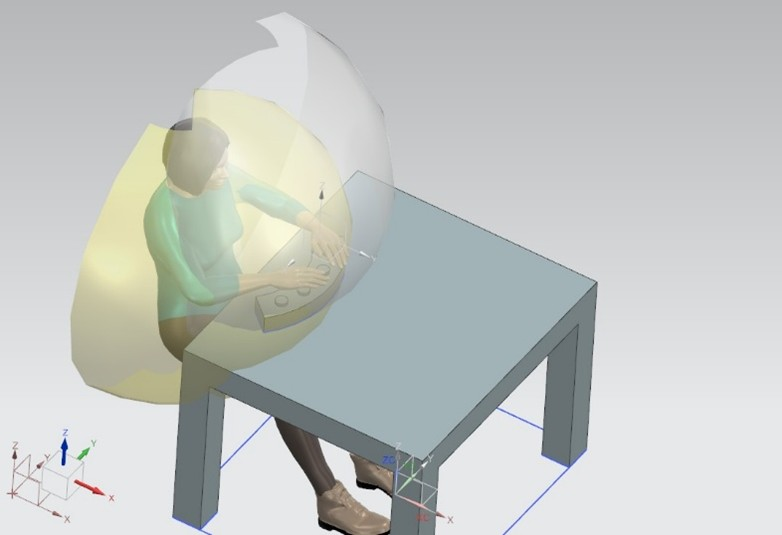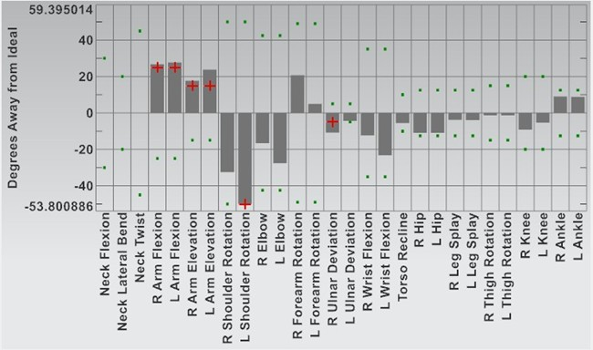

### Conclusies & implicaties
__Vorm van het toestel:__

De gebogen vorm werd het best beoordeeld in de BERT-test, omdat die het minst belastend is voor het lichaam. Daarom wordt er gekozen voor die vorm in het uiteindelijke ontwerp.

__Afstand tot de knop:__

De gemiddelde ideale afstand tussen gebruiker en knop werd vastgesteld op 27,7 cm. Achteraf bekeken is deze test nutteloos aangezien de gebruiker het product kan verplaatsen tot een afstand waar hij het wenst. Deze test schept wel een beeld van de bewegelijkheid van de doelgroep.

__Hoek van het scherm:__

De optimale schermhoek is bepaald op 65 graden. Het scherm wordt onder deze hoek gepositioneerd om leesbaarheid te garanderen zonder visuele of fysieke belasting.

__Antropometrie Siemens NX__

* __Reikwijdte:__ Knoppen mogen niet te ver uit elkaar staan, want de gebruiker kan niet ver reiken. Alles moet dicht bij elkaar zitten.
* __Comfort:__ De meeste houdingen vallen binnen de veilige marge. Kleine afwijkingen zijn verwaarloosbaar.
* __Geen klachten:__ Het gebruik van het product zal geen spierpijn of andere lichamelijke klachten veroorzaken.

__Conclusies__

1. De knoppen moeten makkelijk bereikbaar zijn.
2. De bediening van de knoppen mag geen ongemak veroorzaken bij de gebruiker.
3. De positionering van het scherm mag geen ongemak veroorzaken in de nek.
## 2.2 Develop 2: Cognitieve ergonomie
Gedurende deze fase wordt gekeken naar de cognitieve ergonomie van het product. Daarbij wordt onderzocht in hoeverre de interface en de interactie logisch en begrijpelijk zijn voor de gebruiker. Het doel is dat het systeem gemakkelijk te gebruiken is, zonder dat het onnodig veel denkwerk vereist. Zo kan de gebruiker zich concentreren op de eigenlijke taak, zonder afgeleid te worden door onduidelijke bediening of verwarring over hoe het systeem werkt. Op die manier draagt de test bij aan een gebruiksvriendelijke, efficiënte en toegankelijke gebruikerservaring. 

### Doelstellingen
Nagaan of de interface logisch en gebruiksvriendelijk is, zodat de gebruiker het systeem intuïtief kan bedienen zonder onnodige mentale inspanning. 

### Materiaal & methoden
* __Prototype:__ De basis blijft voor de verschillende testen hetzelfde, enkel bij de derde test komt er een vijfde fysieke knop bij. De verandering in het besturen van de console gebeurt d.m.v. Protopie via de smartphone die verbonden is aan het prototype.

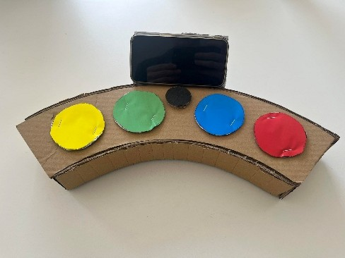

* __Gebruikerstesten (N=4):__ De testen worden wederom afgenomen in een rusthuis bij senioren die cognitief gezond zijn en bij ouderen thuis. Elke van de 3 testen die worden afgenomen per respondent (N=4) bestaan steeds uit 3 dezelfde fases. Deze verschillen van prototype, die worden hieronder uitgelegd. 

_Fase 1_

In het eerste prototype verschijnt de melding “Klik op het scherm om te beginnen”, waarna de kleuren één voor één zichtbaar worden telkens er op het scherm wordt geklikt.

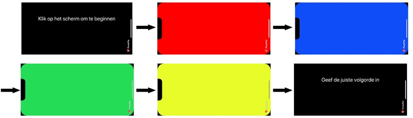

_Fase 2_

In de tweede test blijft de taak dezelfde, maar wordt de interactie aangepast: in plaats van eender waar op het scherm te tikken, moet de gebruiker op een knop in de hoek van het scherm drukken om naar de volgende kleur te gaan.

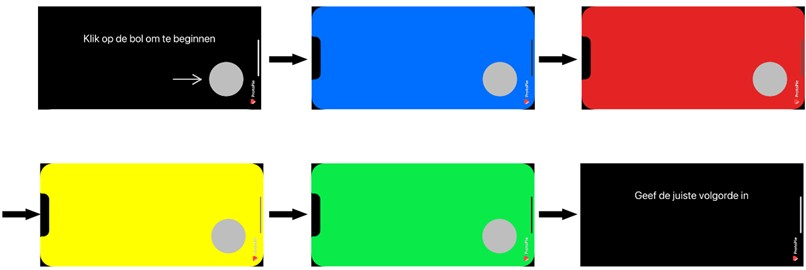

_Fase 3_

In de derde test voert de gebruiker opnieuw dezelfde taak uit, maar via een fictieve vijfde fysieke knop onder het scherm. Deze interactie wordt gesimuleerd met behulp van de wizard-of-oz-methode, waarbij het scherm extern bestuurd wordt.

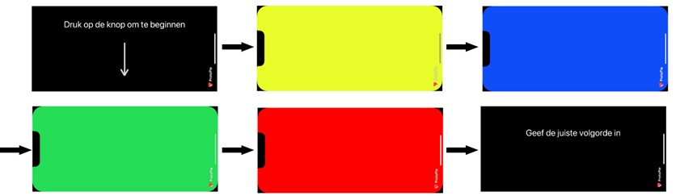

* __Test 1 - Unguided test:__ Bij deze test komt de respondent in contact met de console zonder (extra) uitleg. De respondent moet de interface van begin tot eind bedienen. Om te achterhalen hoe duidelijk de console is, worden zowel de tijd tot het voltooien van de volledige handeling als de fouten die de gebruiker tegenkomt gemeten.

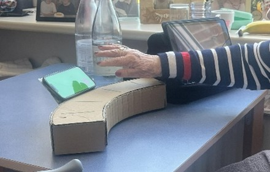

 
* __Test 2 - Think aloud protocol (TAP):__ Dezelfde stappen worden ondergaan als in test 1. Nu moet de respondent luidop vertellen wat hij ziet en denkt tijdens de interactie met het prototype.
* __Test 3 - Guided test:__ Deze test komt overeen met de eerste test, alleen wordt nu alles vooraf uitgelegd. Ook de methode van het verzamelen van de gegevens blijft hetzelfde.

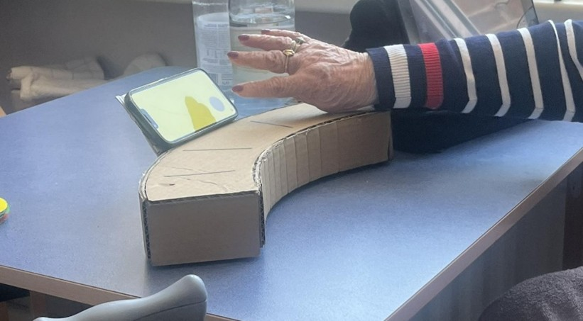

* __Wizard-of-oz:__ Twee smartphones videobellen met elkaar. Eén smartphone deelt het scherm met de andere, zo kan de ene smartphone de interactie met de fysieke knop simuleren.
* __BERT-test:__ Tijdens deze test wordt per prototype een score gegeven van onduidelijk tot duidelijk en van afstotelijk tot uitnodigend.
* __Error-analyse__: Tijdens de test worden het aantal en het type errrors geteld door observatie.

### Resultaten

__Test 1: Unguided test__

De tijd en de errors worden gemeten. De gegevens worden weergegeven in de twee onderstaande tabellen en in het staafdiagram. De participanten kunnen het best overweg met het derde prototype, het prototype met de fysieke knop. Bij prototype 3 zijn er geen errors.

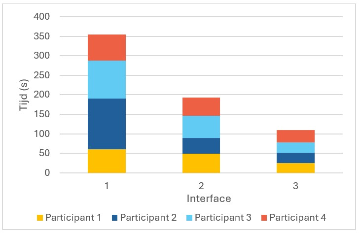
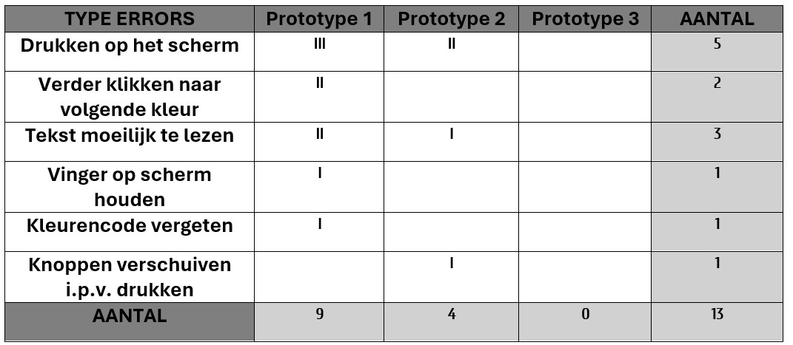

Na afloop van de test leggen de deelnemers een BERT-test af en geven ze hun voorkeur aan. Prototype 3 scoort het best in deze bevraging. De resultaten hiervan zijn te zien hieronder. 

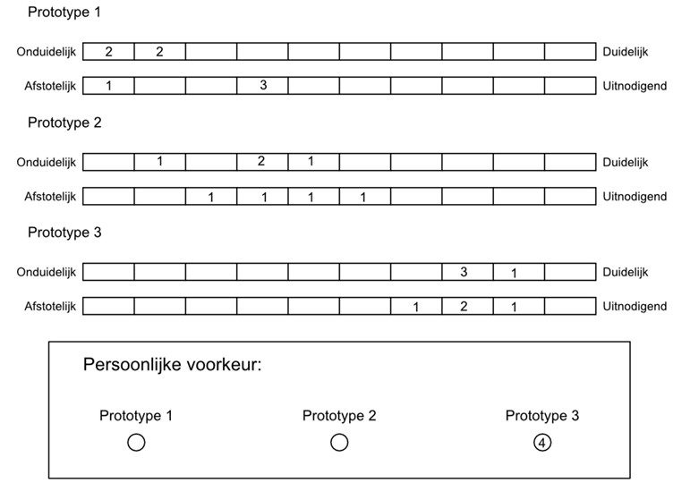

__Test 2: Think aloud protocol (TAP)__

Het TAP verliep niet zoals gehoopt. De ouderen vinden het moeilijk om tegelijkertijd te spreken, nadenken en handelingen uit te voeren. Hierdoor vergeten ze vaak hardop te vertellen wat ze denken, raken ze de kleurenvolgorde kwijt of weten niet meer hoe het prototype werkte. Deze test is dus niet handig voor het verdere verloop van het project. 

__Test 3: Guided test__

Ook voor de guided test wordt de tijd gemeten en worden de errors bijgehouden. Hier haalt ook prototype 3 de beste resultaten.

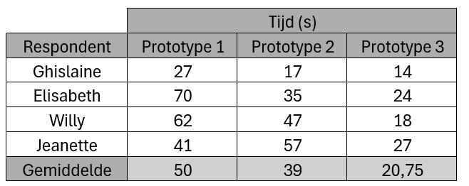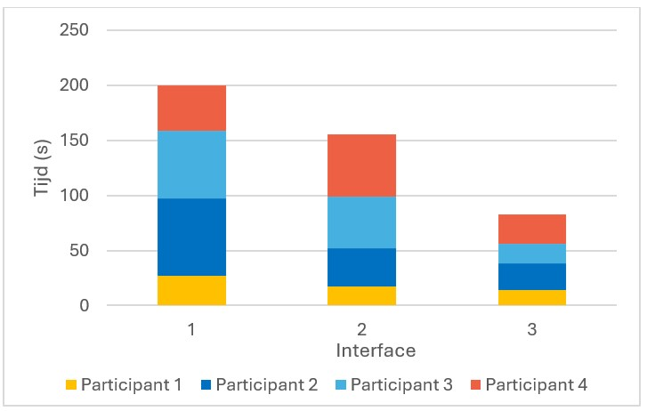
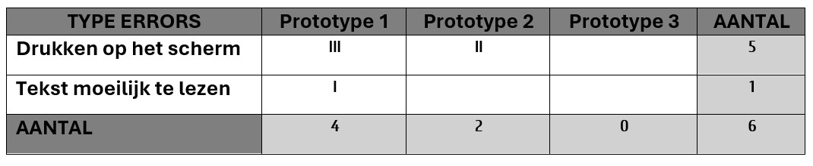

Na de guided test wordt een BERT-test afgenomen. Hier scoort prototype 3 nog beter. 

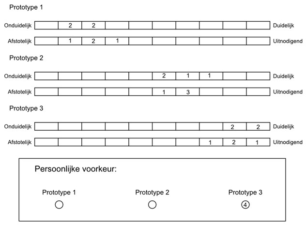

### Conclusies & implicaties
__Gebruikerstests__

* __Tekst op scherm:__ Tekst op het scherm moet groot en beknopt zijn. Zo kunnen gebruikers de informatie sneller verwerken en worden leesfouten vermeden.
* __Bediening scherm:__ Het bedienen van een kleurenvolgorde via een scherm is voor deze doelgroep niet vanzelfsprekend. Voor hen is een intuïtieve en fysieke bediening vaak toegankelijker.
* __Zichtbare knop is noodzakelijk:__ Zonder een zichtbare knop weten gebruikers niet hoe ze naar de volgende kleur moeten gaan. Dit zorgt voor verwarring. Een duidelijke visuele aanwijzing is essentieel om het gebruik vlot te laten verlopen.
* __Complexe bediening:__ Gebruikers vergeten snel hoe het systeem werkt als ze er te veel bij moeten nadenken. Een eenvoudige en logische interface helpt hen om het product correct te gebruiken, zonder extra cognitieve belasting.
* __Beste resultaten:__ Tijdens de test zeiden de meeste mensen dat prototype 3 voor hen het fijnst werkte. Ze vonden het makkelijk en duidelijk. Dat komt overeen met de resultaten, waaruit ook blijkt dat dit prototype het beste scoort.

__Conclusies__

1. Het product wordt zo weinig mogelijk digitaal of met een scherm gestuurd.
2. De tekst op het scherm moet leesbaar zijn.
3. Het moet duidelijk zijn welke knop wanneer moet ingedrukt worden.
4. De interface moet eenvoudig zijn.

## 2.3 Develop 3: Sensoriële ergonomie
In de laatste fase wordt ingegaan op het sensoriële aspect van de console. Zo wordt nagegaan hoe duidelijk en comfortabel de handelingen met het product zijn voor een optimale beleving tijdens de interactie. 

Eerst wordt getest hoeveel verlichting nodig is om de bijbehorende kleur van de knop goed zichtbaar te maken, evenals de optimale positie van die verlichting. De vorm en grootte van de knoppen worden in een apart prototype onderzocht. 
### Doelstellingen
Het evalueren van de sensorische gebruikservaring, met focus op zichtbaarheid, comfort en interactie van de knoppen. 
### Materiaal & methoden
* __Prototype voor de verlichting:__ Het prototype voor het bepalen van de verlichting bestaat uit een houten constructie die is aangepast aan het breadbord en de Arduino UNO. Hierdoor kan een schakeling gemaakt worden, bestaande uit 2 drukknoppen en een strip met Neopixels.  Deze werden onderverdeeld in 4 delen met telkens 5 Neopixels. Indien op de knop wordt gedrukt gaat de bijhorende verlichting aan/uit, telkens in één van de 4 kleuren uit de kleurenvolgorde. Door telkens de code aan te passen kon gevarieerd worden met het aantal en de positie van de Neopixels die worden verlicht. Dit prototype is hieronder afgebeeld. 

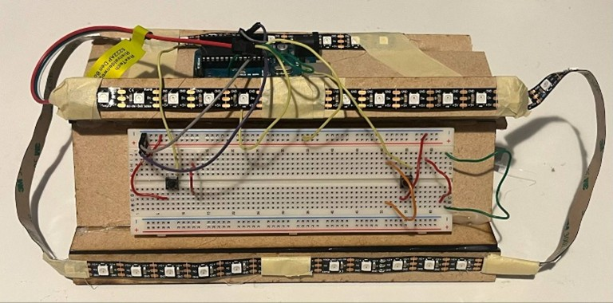

* __Prototype voor de knoppen:__ Het tweede prototype bestaat uit een 3D-geprint bakje met een veer in, waarop knoppen bevestigd kunnen worden. Het bakje is modulair ontworpen, zodat verschillende knoppen erop passen en afzonderlijk getest kunnen worden. Voor testen 2 en 3 zijn een aantal knoppen ontworpen. Onderstaande afbeelding toont het prototype.

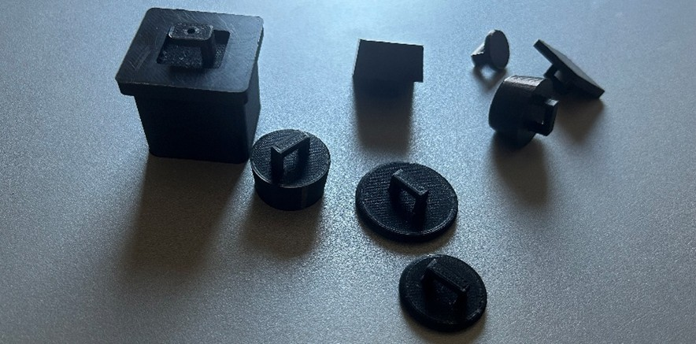

* __Gebruikerstesten (N=4):__

_Test 1: Verlichting_

Tijdens deze test worden telkens verschillende Neopixels opgelicht. De respondent wordt vervolgens gevraagd om met het prototype te interageren door de Neopixels op te lichten via de twee knoppen. Na elke interactie wordt feedback verzameld om te achterhalen welke verlichtingsopstelling de voorkeur krijgt. De verschillende varianten werden gerangschikt en er werd een gewicht toegekend van 1 tot en met 9. (Lage score = slecht, Hoge score = goed). De varianten staan in de tabel hieronder.

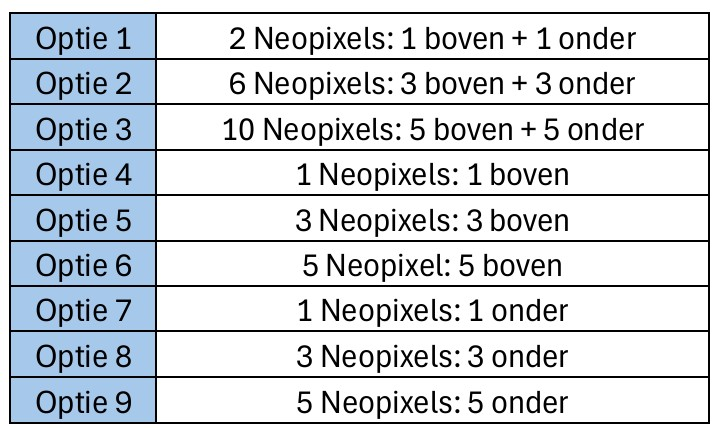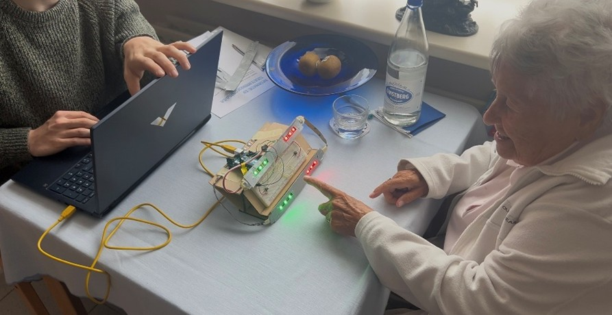

_Test 2: Grootte knoppen_

Hiervoor worden 3 verschillende knoppen getest. Knoppen met een diamater van 20 mm, 30 mm en 40 mm. De knoppen worden gerangschikt en er wordt een gewicht toegekend van 1 tot en met 3.

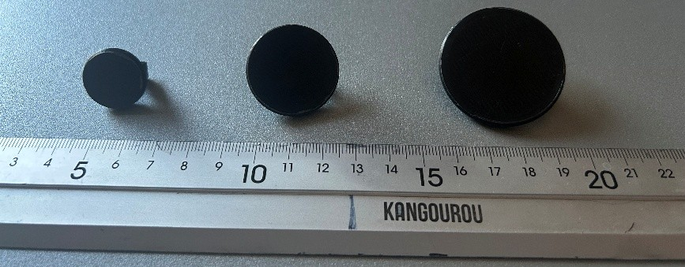

_Test 3: Vorm knoppen_

Tijdens deze test worden 5 verschillende knoppen getest. Ook hier worden de knoppen gerangschikt na het testen. Er wordt een gewicht van 1 t.e.m. 5 toegekend aan de knoppen afhankelijk van de rangschikking.

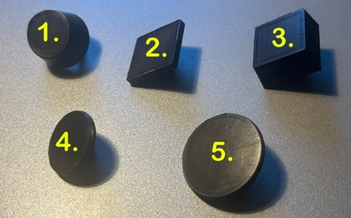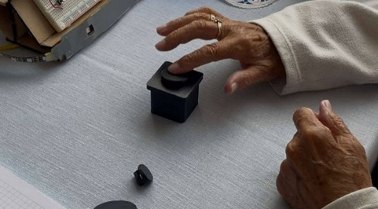

* __Ranking:__ De prototypes worden gerangschikt van slect naar goed. Per positie wordt een gewicht toegekend (gewicht = positie in de rangschikking). Op deze manier kan aan de totaalscore afgeleid worden welke variant het best is.
### Resultaten
De testen worden wederom afgenomen in een rusthuis bij senioren die cognitief gezond zijn en bij ouderen thuis. Deze develop bestaat uit 3 testen waarvoor elk een prototype nodig is. 

__Test 1: Verlichting__

Eén Neopixel onder de knop scoort het best. De tweede beste optie is één Neopixel boven de knop. Wanneer er te veel Neopixels branden verliest de gebruiker het overzicht.

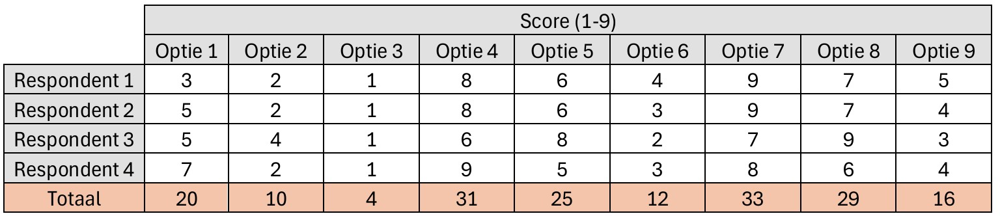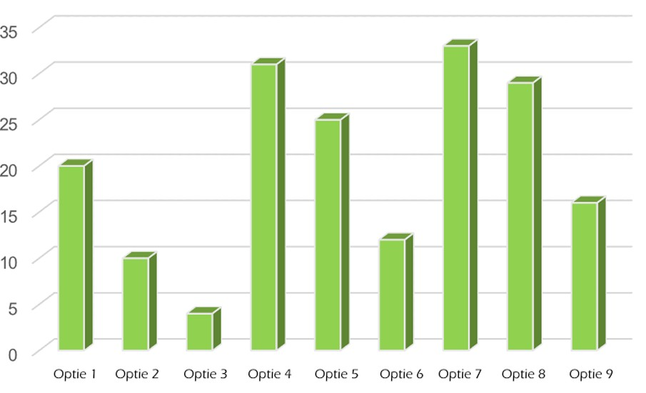

__Test 2: Grootte knoppen__

Elke participant heeft bij deze test dezelfde score gegeven. De grootstet knop van 40 mm scoort het hoogst. 

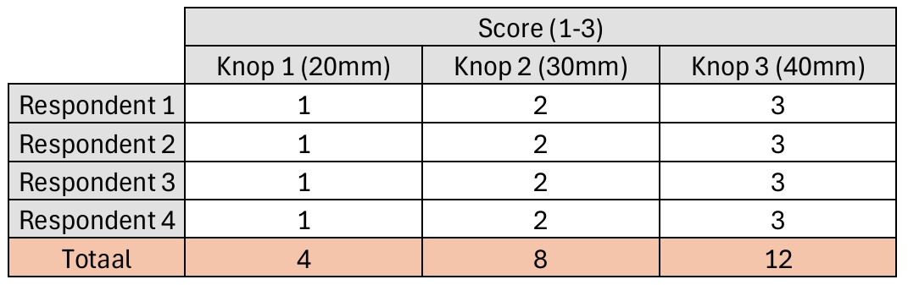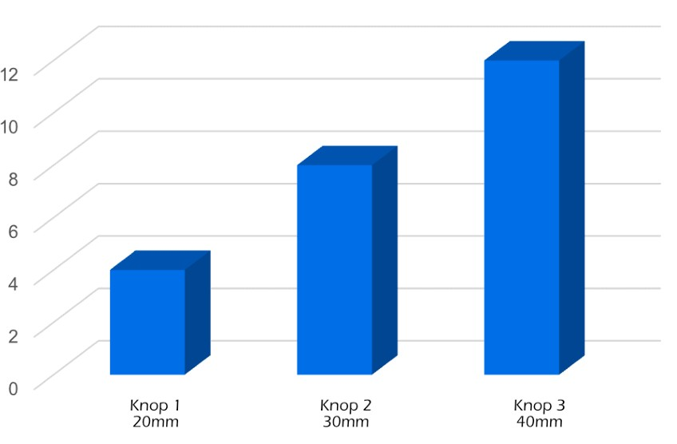

__Test 3: Vorm knoppen__

Knop 1 en knop 3 scoren hier beide het hoogst. Deze twee knoppen zijn beide robuustere knoppen. Daarna komt knop 5 en knop 2. Knop 4 scoort het laagst.

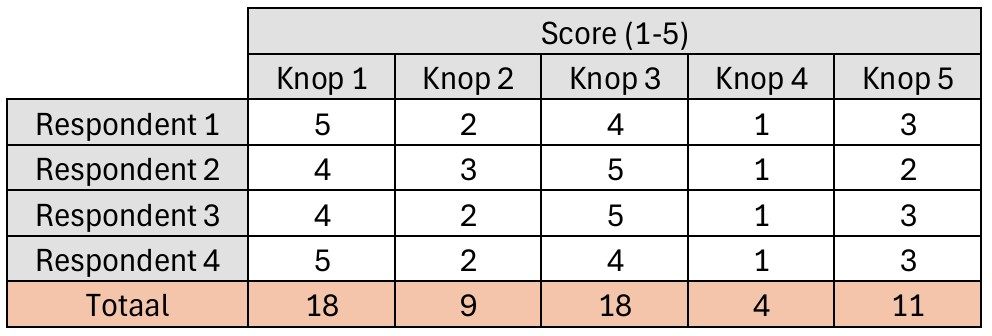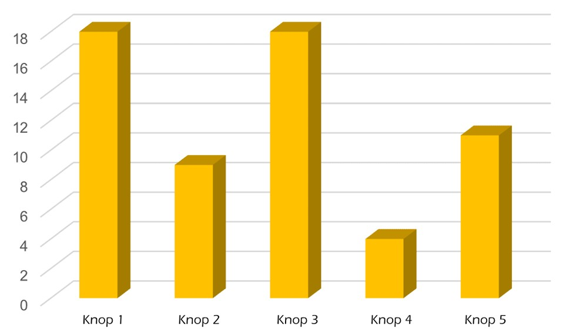

### Conclusies & implicaties
Uit de resultaten van test 1 blijkt dat 1 neopixel onder de drukknop het beste scoort. Over test 2 waren de respondenten het unaniem eens. De grootste knop was de favoriet. Uit de resultaten van test 3 is te zien dat twee knoppen even goed scoren. Deze knoppen zijn eerder grote, grovere knoppen. Ook is het belangrijk dat de lichtjes niet te fel zijn en dat de knoppen voldoende uit elkaar staan.

__Conclusies__
1. De lichtjes die gebruikt worden moeten duidelijk zijn.
2. De lichtjes mogen niet overweldigend zijn
3. De knoppen moeten groot genoeg zijn.
4. De knoppen moeten voelbaar zijn.

## Conclusie
Tijdens dit project werd een spelconsole ontwikkeld met als doel ouderen mentaal actief te houden. De gebruiker krijgt een willekeurige kleurenvolgorde te zien op een display, en moet deze vervolgens correct invoeren met vier fysieke knoppen. Na elke poging volgt duidelijke feedback: bij een correcte invoer een bevestiging, anders een foutmelding.

Bij het ontwerp werd rekening gehouden met verschillende ergonomische en gebruiksvriendelijke aspecten. Er werd geëxperimenteerd met de vorm, plaats en grootte van de knoppen, de hoek van het scherm, en het verschil tussen fysieke en digitale bediening. Deze keuzes zijn telkens getest met eenvoudige prototypes, gebruik makend van Arduino en Protopie.

Hoewel niet alle geplande functies – zoals het gebruik van vormen, speelmogelijkheden met meerdere personen of data-opslag voor zorgprofessionals – konden worden uitgewerkt, biedt het project een goede basis voor verdere ontwikkeling. De testresultaten gaven nuttige inzichten in de noden van de doelgroep en kunnen dienen als richtlijn voor toekomstige iteraties of toepassingen binnen zorgomgevingen.
### Product Requirements 
Onderstaande tabel geeft een overzicht van de belangrijkste algemene productvereisten. Deze zijn afgeleid uit een combinatie van bronnen, waaronder literatuuronderzoek en gebruikerstesten. Hierbij staat steeds een opmerking, waarin vermeld staat hoe daarmee rekening is gehouden in dit project.
| Nr. | Requirement | Bron | Opmerking |
|--------|-------------|------|-----------|
| **1. Gebruiksvriendelijkheid** ||||
| **1.1** | **Eenvoudige interface:** De interface mag enkel de noodzakelijke elementen tonen die nodig zijn voor het spelverloop. | Het volledige project | Er wordt steeds gekozen voor zo weinig mogelijk elementen die voor onduidelijkheid kunnen zorgen. |
| **1.2** | **Visueel ontwerp:** De visuele elementen (kleuren en tekst) moeten voldoende contrast hebben en goed zichtbaar zijn voor ouderen. | Wave 1 & 2 | Hiervoor werden de 4 minst op elkaar lijkende kleuren gekozen. |
| **1.3** | **Eenduidige feedback:** Het systeem moet duidelijke en onmiddellijke feedback geven na elke gebruikersactie. | Develop 5.3 | Feedback wordt versterkt door steeds de led van bijhorende knop extra op te laten lichten. |
| **1.4** | **Tekst:** De tekst in de interface moet eenvoudig en duidelijk zijn of vermeden via symbolen. | Develop 4.2 | De tekst die wordt weergegeven moet kort zijn en in groot lettertype. Indien de tekst te lang is en klein, wordt dit niet goed gelezen. |
| **1.5** | **Fysiek ergonomisch:** De knoppen moeten groot genoeg zijn, voldoende van elkaar gescheiden en makkelijk bereikbaar met beperkte reikwijdte. | Develop 3.1 & 5.3 | Het bereik van de arm (27,7 cm) en de hoek van het scherm (65°) worden bepaald door simulatie in Siemens NX. De grootte van de knop wordt bepaald door interactie met de gebruikers, die de grootste verkiezen. |
| **2. Cognitieve belasting** ||||
| **2.1** | **Aanpasbare moeilijkheidsgraad:** Het systeem moet ondersteuning bieden voor verschillende moeilijkheidsniveaus. | / | Momenteel niet volledig geïmplementeerd, maar voorzien in het ontwerp. |
| **2.2** | **Herkenning:** De gebruiker moet taken kunnen uitvoeren op basis van herkenning van eerder getoonde informatie. | Develop 5.3 | De gebruiker hoeft de kleurenvolgorde niet te onthouden, enkel te herkennen. |
| **2.3** | **Overzichtelijke interface:** De interface moet overzichtelijk zijn en de gebruiker stap voor stap begeleiden in het gebruik. | Develop 5.3 | Bij elke stap krijgt de gebruiker uitleg over wat hij moet doen, zodat het gebruik altijd helder blijft en er geen verwarring ontstaat. |
| **3. Beleving** ||||
| **3.1** | **Verbondenheid:** Het spel moet een gevoel van verbondenheid oproepen: door samen te spelen. | / |  |
| **3.2** | **Stimulerend aspect:** Feedback bij succes moet motiverend en positief zijn, zodat gebruikers worden aangemoedigd. | Develop 5.3 | Wanneer de volgorde correct wordt ingevoerd, krijgt de gebruiker positieve feedback. Bij een fout wordt hij aangemoedigd om opnieuw te proberen, zodat de ervaring motiverend blijft. |
| **3.3** | **Plezier:** Het systeem moet ontworpen zijn om plezier te brengen. De gebruiker moet zich geprikkeld voelen om verder te spelen, niet omdat het moet, maar omdat het leuk is. | Wave 1 | De respondenten testen verschillende opties en geven aan welke hen het meeste plezier gaf. Op basis daarvan werd het ontwerp waar mogelijk verder aangepast. |
| **4. Gezondheid** ||||
| **4.1** | **Mentale stimulatie:** Het spel moet ontworpen zijn om het geheugen, de aandacht en het concentratievermogen van ouderen op een laagdrempelige manier te stimuleren. | Literatuurstudie | Wetenschappelijke studies tonen aan dat geheugenspelletjes cognitieve achteruitgang bij ouderen kunnen vertragen. |
| **4.2** | **Analyseren:** Het systeem moet op termijn data kunnen bijhouden over het gebruik, zodat deze geëvalueerd kunnen worden door externen zoals zorgverleners. | / |  |
| **4.3** | **Vermijden van overbelasting:** Fysieke handelingen bij het gebruik mogen niet leiden tot overbelasting, en moeten voldoende motorische prikkels geven om beweging te stimuleren. | Develop 5.3 | Door gebruikerstesten en simulaties in Siemens NX werd nagegaan hoe ver gebruikers kunnen reiken. Op basis daarvan kan de fysieke belasting beperkt worden door een slimme en doordachte plaatsing van knoppen en scherm. |

## Kritische reflectie
In dit project werkten we met twee studenten aan een product dat het geheugen en de aandacht van ouderen stimuleert, om zo achteruitgang tegen te gaan. We testten verschillende ideeën en leerden veel bij. Hieronder geven we een overzicht van wat goed ging en wat beter kon.

#### Postitieve punten

De samenwerking tussen ons verliep heel vlot. Er wordt geluisterd naar elkaars ideeën, dachten samen na en vonden snel oplossingen.

Alle informatie en resultaten van het eerste semester werden goed bijgehouden. Dat zorgde voor een duidelijke documentatie en hielp bij het verdere verloop van dit project

De prototypes werden heel snel gemaakt, maar waren toch goed genoeg om mee te testen. Ze toonden duidelijk waar verbeterpunten zaten, en gaven ons veel inzichten.

Er wordt waardevolle feedback verkregen van de gebruikers. Ze gaven hun mening over het ontwerp, het spel en de knoppen.

Na elke testfase dachten we goed na over wat beter kon, en pasten we het ontwerp meteen aan. Een voorbeeld is de overstap van ingewikkelde RGB-ledjes naar NeoPixels in combinatie met ProtoPie.

#### Werkpunten
Tijd bleek een uitdaging tijdens het project. Door de samenwerking met het rusthuis en het combineren van schooltaken, raakten bepaalde onderdelen pas op het laatste moment afgewerkt. In het tweede semester is een beter tijdsbeheer een belangrijk aandachtspunt.

De meningen van testers liepen regelmatig uiteen. Met slechts vier/vijf deelnemers per test was het niet eenvoudig om keuzes te maken. Toch kon op basis van hun feedback een geschikt prototype geselecteerd worden.

Niet alle prototypes waren even duidelijk. Sommige kleuren leken te veel op elkaar, wat verwarring veroorzaakte tijdens de testen. Deze ervaring benadrukte het belang van een goed kleurcontrast, zeker bij oudere gebruikers. Ook de tekst, vermeld op het scherm kon duidelijker.

Bepaalde functies zoals samen spelen, uitdagingen en scoreopvolging konden door tijdsgebrek niet uitgewerkt worden.

Een bijkomend aandachtspunt is dat het prototype momenteel geen muziek of auditieve ondersteuning bevat, en ook weinig fysieke beweging vraagt van de gebruiker, wat het spel mogelijk aantrekkelijker en actiever zouden maken.

#### Conclussie
Tijdens dit project werd een gebruiksvriendelijk spel ontwikkeld dat ouderen mentaal prikkelt en hen uitdaagt op een toegankelijke manier. Er werd goed samengewerkt, snel geprototyped en rekening gehouden met feedback van de doelgroep. Ondanks enkele beperkingen, zoals het ontbreken van geluid of meer fysieke interactie, is het eindresultaat iets waar trots op mag worden teruggekeken.
## Technische beschrijving 
### Bill of materials
- Dun hout voor de behuizing
- Scherm om kleurencombinatie te tonen
- Drukknoppen die kunnen oplichten in verschillende kleuren,
  om de combinatie in te geven en het scherm te kunnen bedienen 
## Bijlagen
__Soryboard__

__Persona__

__Discovery__
* __Literatuuronderzoek__
  * <a href="DOCX/Testprotocol Literature review.pdf" target="_blank">Protocol (PDF)</a>
  * <a href="DOCX/Rapport Literature review.pdf" target="_blank">Rapport (PDF)</a>
* __Interview__
  * <a href="DOCX/Testprotocol interview.pdf" target="_blank">Protocol (PDF)</a>
  * <a href="DOCX/Rapport interview.pdf" target="_blank">Rapport (PDF)</a>
  * <a href="DOCX/Informed consent interview.pdf" target="_blank">Informed Consent (PDF)</a>

__Definition__
* __Wave 1 gebruikerstesten__
  * <a href="DOCX/Testprotocol wave 1.pdf" target="_blank">Protocol (PDF)</a>
  * <a href="DOCX/Rapport Wave 1.pdf" target="_blank">Rapport (PDF)</a>
  * <a href="DOCX/informed consent wave 1.pdf" target="_blank">Informed Consent (PDF)</a>
* __Wave 2 gebruikerstesten__
  * <a href="DOCX/Testprotocol wave 2.pdf" target="_blank">Protocol (PDF)</a>
  * <a href="DOCX/Rapport Wave 2.pdf" target="_blank">Rapport (PDF)</a>
  * <a href="DOCX/informed consent wave 2.pdf" target="_blank">Informed Consent (PDF)</a>

__Develop__
* __Develop 1__
  * <a href="DOCX/Testprotocol D3.1.pdf" target="_blank">Protocol (PDF)</a>
  * <a href="DOCX/Rapport D3.1.pdf" target="_blank">Rapport (PDF)</a>
* __Develop 2__
  * <a href="DOCX/Testprotocol D4.2.pdf" target="_blank">Protocol (PDF)</a>
  * <a href="DOCX/Rapport D4.2.pdf" target="_blank">Rapport (PDF)</a>
* __Develop 3__
  * <a href="DOCX/Testprotocol D5.3.pdf" target="_blank">Protocol (PDF)</a>
  * <a href="DOCX/Rapport D5.3.pdf" target="_blank">Rapport (PDF)</a>
## Bronnen

[^1]: Corrada, M. M., Brookmeyer, R., Paganini‐Hill, A., Berlau, D., & Kawas, C. H. (2009). Dementia incidence continues to increase with age in the oldest old: The 90+ study. Annals Of Neurology
