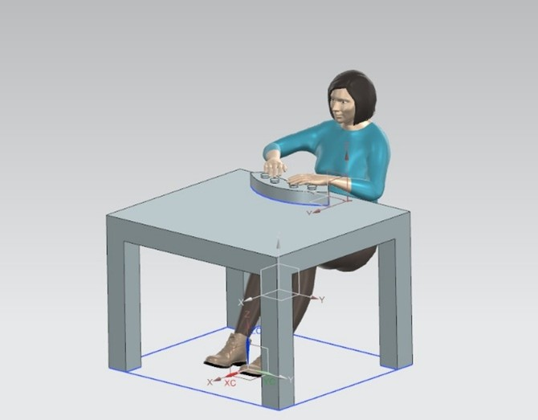
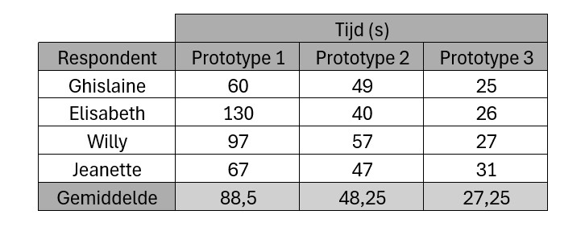

# Intelight
*Het combineren van fysieke activiteit en cognitieve stimulatie die zowel het lichaam als de hersenen versterkt, wat helpt om geheugenverlies preventief tegen te gaan.*

*Projectteam: De Waele Briek; De Croo Nand*

18/06/2025
## Samenvatting
Veel mensen ervaren bij henzelf of rondom hen mentale achteruitgang naarmate ze ouder worden. Hierdoor ontstaan geheugenproblemen en een verminderende cognitieve functie. Dit is onderzocht aan de hand van literatuurstudie en interviews. De conclusie hieruit is dat het noodzakelijk is om tijdig preventieve maatregelen te gaan nemen om zo de hersenen actief te houden en geheugenverlies te vertragen. Een manier om dit te bereiken, is door het trainen van het geheugen met cognitieve oefeningen.  

De cognitieve oefening hiervoor is Intelight, een slimme console die gebruikers helpt hun geheugen te trainen door middel van interactieve kleurcombinatiespelletjes. De console stimuleert hersentraining waardoor het brein actief blijft en biedt verschillende denkoefeningen met verschillende moeilijkheidsniveaus, wat de doelgroep doet uitbreiden. 

## Introductie
Het project is vetrokken uit de design challenge “Healthy Aging”, waarbij het ontwerpen van slimme producten die zorgen voor het gezond verouderen centraal staat.  

Doordat de bevolking steeds ouder wordt, neemt ook het aantal dementerenden toe [^1]. Met dit probleem wordt in dit project aan de slag gegaan om dit zo veel mogelijk te gaan beperken. 

Een techniek die hedendaags wordt gebruikt om cognitieve achteruitgang tegen te gaan is de Ronnie Gardiner Methode (RGM). Het is een multi-sensorische oefenmethode. Er wordt muziek en ritme ingezet om meerdere gebieden van de hersenen te stimuleren.

Het project is gebaseerd op het onthouden van één of meerdere combinaties. Hierbij wordt als combinatie kleuren gebruikt. Die kleuren worden getoond d.m.v. een scherm. Na de combinatie gezien te hebben moet de combinatie correct worden ingegeven d.m.v. gekleurde knoppen. De cognitieve oefening kan gespeeld worden op verschillende niveaus. Zo kan er gevarieerd worden met de visualisatie van de kleurencombinatie. De duur van elke kleur kan zo korter/langer zichtbaar gemaakt worden, of ze kiezen de duur door zelf het scherm te besturen. Ook kan er met de knoppen gevarieerd worden. Deze kunnen op voorhand of slechts een beperkte tijd zichtbaar zijn. Ook het aantal kleuren (= aantal knoppen) kan aangepast worden aan de gebruiker. Deze parameters zorgen ervoor dat elke gebruiker met deze cognitieve oefening wordt uitgedaagd. 

Door deze kleurcombinaties te gaan onthouden wordt het werkgeheugen en de visuele perceptie getraind en actief gehouden. Dit veroorzaakt de vertraging van de cognitieve achteruitgang van het brein. De belangrijkste randvoorwaarden hierbij zijn: 

* Gebruiksvriendelijk: De gebruikers moet zich comfortabel voelen tijdens de interactie met het product.
* Vermakelijk: De gebruiker mag zich niet vervelen.
* Aanpasbaar niveau: Het product openstellen voor mensen van verschillende niveaus om het uitsluiten van mensen te beperken.
* Veiligheid: De doelgroep zijn ouderen. Het is een kwetsbare groep. Scherpe randen vermijden.
## Methodologie
Als weergave van de methodologie werd een variant op de methode van de ‘Double Diamond’ toegepast. Deze methode laat toe om meerdere keren te divergeren en convergeren. Er wordt gewerkt in verschillende fases.

__Discovery__

Tijdens de discovery fase werd research gedaan naar het onderwerp en de doelgroep. Ook werd meer kennis opgedaan door interviews, met zowel de gebruiker als met 3 ervaringsdeskundigen, en een literatuurstudie. Hierdoor werd er divergerend gebrainstormd en konden ideeën ontwikkeld worden. De ideeën worden geconvergeerd tot een concept dat gepitcht wordt. 

__Definition__

In het begin van de definition fase wordt gedivergeerd om verschillende concepten te testen. In twee waves worden verschillende prototypes getest om het concept te valideren. Door de testen worden probleempunten duidelijk en kunnen conclusies getrokken worden.  Hierdoor wordt geconvergeerd naar 1 idee die wordt voorgesteld in het storyboard. Deze fase eindigt met de presentatie.

__Develop 1__

Tijdens de eerste development fase wordt de fysieke ergonomie van het product onderzocht. Hier wordt er aandacht besteed aan de vorm van het product. Er worden verschillende prototypes getest.

__Develop 2__

In de tweede development fase wordt de cognitieve ergonomie onder de loep genomen. Drie interfaces worden getest. Ook worden aanvullende tests uitgevoerd in verband met de fysieke ergonomie. Hiervoor wordt Siemens NX Human Modelling gebruikt.

__Develop 3__

Tijdens de derde development fase wordt de sensoriële ergonomie getest. Er worden testen gedaan i.v.m. LED's en knoppen. Hier worden de details verfijnd.

__Delivery__

Het finale design ligt vast en een prototype wordt uitgewerkt.

## 1.1 Discovery
### Doestellingen
Een belangrijke doelstelling was het bestuderen van het probleem, d.m.v. interviews en literatuur, om zo zich te hebben op het probleem en een oplossing te gaan bedenken. Wat ook een doelstelling was, was het convergeren van de verschillende concepten naar 1 gekozen concept. Dit werd bekomen door de concepten te gaan uitwerken d.m.v. prototypes. Vervolgens werden deze prototypes in contact gebracht met de doelgroep van dit project. Zo kon het gedrag van de gebruiker onderzocht worden, wat ook een doelstelling was dit semester.  
### Materiaal & methoden
De gebruikte methodes waren: 

* Interview met ervaringsdeskundige 

* Literatuurstudie
### Resultaten
__Interview met ervaringsdeskundige (N= 3)__

Er werden interviews afgenomen met een ervaringsdeskundigen die diepgaande kennis heeft over de motoriek en het samenwerken van hersenhelften, om die zo te gaan stimuleren. Die expertise was handig om de context verder te verduidelijken en de informatie uit de interviews met de doelgroep te verrijken en te onderbouwen. 

__Literatuurstudie (N= 10)__ 

Aan de hand van literatuurstudie werd onderzocht welke activiteiten een impact hebben op cognitie. Er werd onderzoek gedaan naar de Ronnie Gardiner Methode, maar ook naar de effecten van muziek, fysieke en cognitieve oefeningen op de hersenen. 
### Conclusies & implicaties

Uit de literatuurstudie blijkt dat door muziek, fysieke en cognitieve oefeningen te combineren worden de hersenen gestimuleerd in verschillende gebieden. Ook groepsactiviteiten hebben een positief effect, het zorgt voor een sociale verbondenheid en een vermindering van stress.

Uit de interviews werd afgeleid dat combinaties onthouden en reactie vermogen positieve reacties krijgt. Door dit te combineren met een fysieke beweging wordt een goede oefening gecreëerd die de hersenen stimuleren in verschillende gebieden. Het is ook belangrijk dat het product eenvoudig te gebruiken is, zeker als de gebruiker op leeftijd is.
## 1.2 Definition
Tijdens de definitiefase worden mogelijke oplossingen onderzocht en geëvalueerd om zo tot een concept te komen. 
### Doestellingen
* Storyboard 
* Quick-and-dirty prototypes 
* Concept bekomen 
* Concept valideren 
### Materiaal & methoden
* Prototypes uit hout 
* Prototypes uit karton 
* Digitale interface 
* Gebruikerstesten 
* Gebruikersinterviews 
### Resultaten
De concepten worden geëvalueerd aan de hand van gebruikerstesten. Dit gebeurt met gebruikers uit de doelgroep die we voor ogen hebben. Op deze manier kunnen we tijdens de interactie problemen of moeilijkheden observeren. 

__WAVE 1__ 

Het doel bij de eerste gebruikerstest is om het concept te valideren. Na een korte introductie worden de drie prototypes voorgesteld. Bij elk van de drie prototypes is het concept een klein beetje anders. De prototypes werden dan in een willekeurige volgorde uitgetest. Na de testen werd de gebruiker geïnterviewd. Alle data zijn digitaal bijgehouden. 

    

Na de testen werden de interviews geanalyseerd. Tijdens de analyse werden drie scoringsmatrices opgesteld. Er kon een score van 0 tot en met +4 gegeven worden. Aan de hand van de totaalscores zien we welk prototype op welke categorie het best scoort. 

  

__WAVE 2__

Uit de eerste gebruikerstest werd een concept geselecteerd om op verder te bouwen. Er werden drie prototypes bedacht en uitgewerkt. Tijdens deze gebruikerstest ligt de focus op de interactie met het prototype. In het tweede semester ligt de focus op het ontwerpen van de interface. De interactie tussen de gebruiker en het prototype varieert bij elk prototype. Knoppen die al dan niet zichtbaar zijn, de combinatie die op een vaste of een zelf-regelbare snelheid afspeelt. Tijdens deze gebrukerstets wordt op dezelfde manier te werk gegaan als in de eerste gebruikerstest. Eerst de prototypes laten uittesten, daarna de gebruiker interviewen en achteraf analyseren. Voor bepaalde criteria werden weer scoringsmatrices opgesteld.  

 
  
  

  

### Conclusies & implicaties
Uit de gebruikerstesten en gebruikersinterviews konden een paar conclusies en implicaties getrokken worden. Deze staan hieronder opgesomd. 

__1. Variëteit van de doelgroep__

Zowel de leeftijd als ook de capaciteiten van de doelgroep zijn heel verschillend. Hierdoor is het belangrijk dat er verschillende moeilijkheidsniveaus zijn zodat elke gebruiker mentaal getraind kan worden. Het prototype waarbij enkel de plaats en volgorde van de opgelichte cirkel moest onthouden worden (uit wave 1) was voor de meesten te makkelijk. Het prototype waarbij men de taak kreeg om zowel de volgorde van de kleuren als de kleuren van de knoppen te onthouden was voor de meesten dan weer te moeilijk. In het 2e semester moet hierin een evenwicht gevonden worden. 

__2. Technologisch aspect van het ontwerp__

Bij het prototype waarbij men zelf op het scherm ging tikken om zo de snelheid van de kleurencombinatie aan te passen, kon er geconcludeerd worden dat dit vaak voor moeilijkheden zorgde. Dit kan eventueel opgelost worden door het scherm te besturen met knoppen, i.p.v. het tikken op het scherm. 

__3. Moeilijkheden drukknop__

Na het zien van de kleurenvolgorde bij de test met het scherm en de 4 knoppen (uit wave 1) is het de bedoeling dat de kleurencombinatie gaat ingeven waarbij elke knop staat voor een kleur, visueel zichtbaar gemaakt door de latjes die erboven werden geplaatst. Dit zorgde voor verwarring, aangezien ze niet op de knoppen drukten maar op de kleuren van de latjes. Hier werd rekening mee gehouden in wave 2 waarbij de kleuren op de knoppen stonden. 

__4. Verwarring door aftellen__

Voordat de kleurencode op het scherm getoond werd, werd er eerst afgeteld. Voor sommige testers was dit onduidelijk, aangezien ze het idee hadden dat ze de cijfers moesten onthouden i.p.v. de kleurenvolgorde. Dit zorgde voor verwarring. In plaats van het aftellen bijvoorbeeld kan een balk gebruikt worden die van 0 naar 100% gaat in het tweede semester. 

__5. Timing__

Wat verwarrend was voor sommige testers in wave 1 bij het prototype met het scherm en de knoppen, was de timing van het ingeven van de kleurencombinatie. Zo drukten testers de knoppen al in voordat de kleurencombinatie volledig getoond was. Hier werd op ingegaan bij de 2e wave waarbij de knoppen pas na de combinatie zichtbaar werden. Dit had een positieve invloed op de testen. 

__6. Keuze van concept__

Uit wave 1 kon geconcludeerd worden dat het prototype met het scherm en de 4 knoppen waarbij de kleurencombinatie onthouden moest worden het meest in de smaak viel bij de testers. Daar werd op ingegaan in wave 2. Ook de prototypes, die zijn gemaakt door het divergeren van het gekozen concept van wave 2, werden door 4 van de 5 testers goedgekeurd. Op deze concept wordt dus verdergegaan in het tweede semester.

## 2.1 Develop 1
Tijdens deze fase wordt de fysieke ergonomie onderzocht. Dit is een belangrijk onderdeel aangezien senioren minder flexibel en bewegelijk zijn. De focus ligt vooral op de schouder, bovenarm en nek omdat de beze delen het meest belast worden.

### Doelstellingen
Met deze test worden de dimensies en de vorm van het product bepaald. Er worden ook inzichten verworven over de bewegelijkheid van senioren. 

### Materiaal & methoden
* Prototype uit hout 
* Prototypes uit karton  
* Gebruikerstesten 
* Gebruikersinterviews
* BERT-test

### Resultaten
De testen worden afgenomen in een rusthuis bij senioren die cognitief gezond zijn. Er worden tijdens deze fase 3 testen afgenomen per respondent (N=4).

__Test 1__

Met deze test wordt de vorm van het product bepaalt. De knoppen worden telkens in een andere vorm geplaatst. Hiervoor zijn drie prototypes gemaakt. Prototype 1 heeft de vorm van een balk en heeft vier knoppen. Prototype 2 heeft de vorm van een vierkant. Het laatste prototype heeft de vorm van boog. Op de prototypes staan lijnen met daarop gekleurde schijfjes als voorstelling van een knop. Telkens wordt gevraagd aan de respondent om de schijfjes te verschuiven volgens de richting van de lijnen. Na de test wordt de BERT-test ingevuld.

  

__Test 2__

Tijdens test 2 verschuift de respondent een schijfje tot zijn of haar ideale afstand waar de schouder en arm het meest comfortabel aanvoelen. Vervolgens wordt de afstand opgemeten. Hiermee wordt een beeld geschept over de bewegelijkheid van de senioren.

 

__Test 3__

Het scherm van het product moet onder een bapaalde hoek geplaatst worden. Om de hoek te bepalen wordt, tijdens test 3, een prototype gebruikt waarbij een scherm rond een as kan roteren. Het scherm wordt langzaam verplaatst. De respondent zegt "stop" op de positie waar het voor hem of haar onder de ideale hoek staat.

 

### Conclusies & implicaties

## 2.2 Develop 2
Gedurende deze fase wordt gekeken naar de cognitieve ergonomie van het product. Daarbij wordt onderzocht in hoeverre de interface en de interactie logisch en begrijpelijk zijn voor de gebruiker. Het doel is dat het systeem gemakkelijk te gebruiken is, zonder dat het onnodig veel denkwerk vereist. Zo kan de gebruiker zich concentreren op de eigenlijke taak, zonder afgeleid te worden door onduidelijke bediening of verwarring over hoe het systeem werkt. Op die manier draagt de test bij aan een gebruiksvriendelijke, efficiënte en toegankelijke gebruikerservaring. 

Ook wordt er nog een aanvullende analyse uitgevoerd om bijkomende inzichten te verwerven in de fysieke ergonomie.

### Doelstellingen
Nagaan of de interface logisch en gebruiksvriendelijk is, zodat de gebruiker het systeem intuïtief kan bedienen zonder onnodige mentale inspanning. 

### Materiaal & methoden
* Het prototype, gekozen in Develop 1 
* Smartphone (voor Protopie) 
* Smartphone (voor wizard-of-oz methode) 
* Gebruikerstesten 
* Gebruikersinterviews 
* Wizard-of-oz 
* BERT-test 
* Think aloud protocol (TAP) 
* Error-analyse
* Siemens NX human modelling

### Resultaten
De testen worden wederom afgenomen in een rusthuis bij senioren die cognitief gezond zijn en bij ouderen thuis. Elke van de 3 testen die worden afgenomen per respondent (N=4) bestaan steeds uit 3 dezelfde fases. Deze verschillen van prototype, die worden uitgelegd hieronder. 

_Prototypes_

De basis blijft voor de verschillende testen hetzelfde, enkel bij de derde test komt er een vijfde fysieke knop bij. De verandering in het besturen van de console gebeurt d.m.v. Protopie via de smartphone die verbonden is aan het prototype.  

_Fase 1_

In het eerste prototype verschijnt de melding “Klik op het scherm om te beginnen”, waarna de kleuren één voor één zichtbaar worden telkens er op het scherm wordt geklikt.

_Fase 2_

In de tweede test blijft de taak dezelfde, maar wordt de interactie aangepast: in plaats van op het scherm te tikken, moet de gebruiker op een knop in de hoek van het scherm drukken om naar de volgende kleur te gaan.

_Fase 3_

In de derde test voert de gebruiker opnieuw dezelfde taak uit, maar via een fictieve vijfde fysieke knop onder het scherm. Deze interactie wordt gesimuleerd met behulp van de wizard-of-oz-methode, waarbij het scherm extern bestuurd wordt.

_Aanvullende analyse_

Hier wordt gebruik gemaakt van Siemens NX human modelling. Er wordt een vrouw van 79 jaar gesimuleerd. Er wordt gekozen voor een vrouw omdat vrouwen gemiddeld lager leven dus de kans dat een vrouw het product gebruikt is groter en 79 jaar is de maximale leeftijd dat geselecteerd kan worden. De opstelling is te zien op de afbeelding hieronder.

__Test 1: Unguided test__

Bij deze test komt de respondent in contact met de console zonder (extra) uitleg. Om te achterhalen hoe duidelijk de console is, worden zowel de tijd tot het voltooien van de volledige handeling als de fouten die de gebruiker tegenkomt gemeten. De gegevens worden weergegeven in de twee onderstaande tabellen en in de staafgrafiek. 

Na afloop van de test legden de deelnemers een BERT-test af en gaven ze hun voorkeur aan. De resultaten hiervan zijn te zien hieronder. 

__Test 2: Think aloud protocol (TAP)__

Het TAP verliep niet zoals gehoopt. De ouderen vonden het moeilijk om tegelijkertijd te spreken, nadenken en handelingen uit te voeren. Hierdoor vergaten ze vaak hardop te vertellen wat ze dachten, raakten de kleurenvolgorde kwijt of wisten niet meer hoe het prototype werkte. Deze test is dus niet handig voor het verdere verloop van het project. 

__Test 3: Guided test__

Deze test komt overeen met de eerste test, alleen wordt nu alles vooraf uitgelegd. Ook de methode van het verzamelen van de gegevens blijft hetzelfde. Deze staan hieronder. 

Ook na de guided test werd een BERT-test afgenomen. 

__Human modelling__

In deze aanvullende test wordt gekeken hoe ver een gemiddelede vrouw van 79 jaar oud kan uitreiken. Ook wordt gekeken naar het comfortgevoel in de armen omdat deze het meest belast worden.

### Conclusies & implicaties

## 2.3 Develop 3
In de laatste fase wordt ingegaan op het sensoriële aspect van de console. Zo wordt nagegaan hoe duidelijk en comfortabel de handelingen met het product zijn voor een optimale beleving tijdens de interactie. 

Eerst wordt getest hoeveel verlichting nodig is om de bijbehorende kleur van de knop goed zichtbaar te maken, evenals de optimale positie van die verlichting. De vorm en grootte van de knoppen worden in een apart prototype onderzocht. 
### Doelstellingen
Het evalueren van de sensorische gebruikservaring, met focus op zichtbaarheid, comfort en interactie van de knoppen. 
### Materiaal & methoden
* Prototype voor de verlichting 
* Prototype voor de knoppen 
* Gebruikerstesten 
* Ranking 
### Resultaten
De testen worden wederom afgenomen in een rusthuis bij senioren die cognitief gezond zijn en bij ouderen thuis. Deze develop bestaat uit 3 testen waarvoor elk een prototype nodig is. 

_Prototypes_

Het prototype voor het bepalen van de verlichting bestaat uit een houten constructie die is aangepast aan het breadbord en de Arduino UNO. Hierdoor kon een schakeling gemaakt worden, bestaande uit 2 drukknoppen en een strip met Neopixels.  Deze werden onderverdeeld in 4 delen met telkens 5 Neopixels. Indien op de knop wordt gedrukt gaat de bijhorende verlichting aan/uit, telkens in één van de 4 kleuren uit de kleurenvolgorde. Door telkens de code aan te passen kon gevarieerd worden met het aantal en de positie van de Neopixels die worden verlicht. Dit prototype is hieronder afgebeeld. 

Het tweede prototype bestaat uit een 3D-geprint bakje met een veer, waarop knoppen bevestigd kunnen worden. Het bakje is modulair ontworpen, zodat verschillende knoppen erop passen en afzonderlijk getest kunnen worden. Voor testen 2 en 3 zijn een aantal knoppen ontworpen. Onderstaande afbeelding toont het prototype. 

__Test 1: Verlichting__

Tijdens deze test worden telkens verschillende Neopixels opgelicht. De respondent wordt vervolgens gevraagd om met het prototype te interageren door de Neopixels op te lichten via de twee knoppen. Na elke interactie wordt feedback verzameld om te achterhalen welke verlichtingsopstelling de voorkeur krijgt. De verschillende varianten werden gerangschikt en er werd een gewicht toegekend van 1 tot en met 9. (Lage score = slecht, Hoge score = goed)

__Test 2: Grootte knoppen__

Hiervoor worden 3 verschillende knoppen getest. Knoppen met een diamater van 20 mm, 30 mm en 40 mm. De knoppen worden gerangschikt en er wordt een gewicht toegekend van 1 tot en met 3.

__Test 3: Vorm knoppen__

Tijdens deze test worden 5 verschillende knoppen getest. Ook hier worden de knoppen gerangschikt na het testen. Er wordt een gewicht van 1 t.e.m. 5 toegekend aan de knoppen afhankelijk van de rangschikking.

### Conclusies & implicaties
Uit de resultaten van test 1 blijkt dat 1 neopixel onder de drukknop het beste scoort. Over test 2 waren de respondenten het unaniem eens. De grootste knop was de favoriet. Uit de resultaten van test 3 is te zien dat twee knoppen even goed scoren. Deze knoppen zijn eerder grote, grovere knoppen.

Ook is het belangrijk dat de lichtjes niet te fel zijn en dat de knoppen voldoende uit elkaar staan.
## Conclusie
|Nummer|Criteria|Bron|Datum|Toestand + Toepassing|
|---|---|---|---|---|
|0.1|Het ontwerp moet de structuur die in de klas word gebruikt ondersteunen|Interviews|12/11/2024|OK|
|0.2|Het kostenplaatje is zo laag mogelijk|Concepttesten wave 1|30/11/24|

In Progress
 Hier werd rekening mee gehouden voor het finale resultaat, door bijvoorbeeld in kunsstof te werken maar kan nog verder onderzocht worden.|
|**1 Interface leerlingen**|
|1.1 Algemeen|
|1.1.1|Leerlingen leren actief nadenken over welke emoties ze ervaren|Literatuuronderzoek|14/11/2024|

OK
 Dit wordt geïmplementeerd in alle prototypes (zowel wave 1 als wave 2) door de leerlingen zelf hun emoties te laten aanduiden. Tijdens develop 3 werd deze DR bevestigd.
|
|1.1.2|Het ontwerp moet regelmatig gebruik stimuleren|Literatuuronderzoek, concepttesten wave 1|14/11/2024|

OK
 Getest in develop 1 en 3 door feedback en microinteractions toe te voegen aan de interface.
|
|1.1.3|De interface leidt niet af van de les|Interview|14/11/2024|

OK
 Getest en bevestigd in develop 3 door de fly on the wall observatie.
|
|1.1.4|De interface is compact|Concepttesten wave 1|28/11/2024|

OK
 Dit wordt geïmplementeerd in de prototypes van wave 1 en wave 2 door de prototypes klein te houden. Het finale resultaat zal nog kleiner zijn dan de prototypes omdat de elektronica campacter gemaakt kan worden.
|
|1.1.5|Robuust genoeg|Concepttesten wave 1|28/11/2024|

In progress
 Tijdens het testen in de develop 3 fase is een bakje gevallen en was deze niet kapot. Bij het einresultaat is het belangrijk dat het materiaal niet te bros is en dat alles goed vast zit.
|
|1.1.6|De leerlingen kunnen discreet hun emotie aanduiden|Concepttesten wave 1|28/11/2024|

OK
 Dit wordt geïmplementeerd in prototypes 1 en 2 van wave 1 en het prototype van wave 2 door een klepje toe te voegen. Hierdoor kunnen anderen moeilijker meekijken met wat de leerling aanduid.
|
|1.1.7|Het product maakt geen storend geluid|Concepttesten wave 1|28/11/2024|

OK
 De prototypes uit develop 3 maakten geen geluid wanneer een emotie werd aangeklinkt. Ook dem feedback en microinteractions maken geen gebruik van geluid.
|
|1.1.8|Makkelijk verplaatsbaar|Concepttesten wave 1|28/11/2024|

OK
 Dit wordt geïmplementeerd in alle prototypes door ze compact en draadloos te houden.
|
|1.1.9|Het product is geschikt voor verschillende soorten schoolbanken|Concepttesten wave 2|12/12/2024|

OK
 Dit wordt geïmplementeerd in het prototype van wave 2. Deze werd zo gevormd dat hij voor verschillende banken geschikt is. Door het afneembaar klepje kan deze zowel in als op de bank gebruikt worden.
|
|1.2 Learnability|
|1.2.1|De leerling kan de correcte emotie aan de symbolen koppelen|Literatuuronderzoek|14/11/2024|

OK
 Dit werd getest tijdens wave 1 waarbij de leerlingen bevraagd werden over welke emoties de verschillende emoties de knoppen afbeeldde. Dit werd nogmaals gevalideerd in wave 2.
|
|1.2.2|De interface is toegankelijk voor leerlingen van het 1e tot en met het 3e leerjaar|Interview|14/11/2024|

OK
 Dit werd getest tijdens wave 1 en wave 2 waarbij testen werden gedaan bij leerlingen van het 1e en het 3e leerjaar. Hierbij werd vastgesteld dat zowel de leerlingen van het 1e als die van het 3e leerjaar het concept en gebruik begrepen.
|
|1.3 Gebruiksgemak|
|1.3.1|De interface is makkelijk te bedienen|Literatuuronderzoek|14/11/2024|

OK
 Door minimale handelingen met de interface werd in wave 1 en 2 vastgesteld dat de interface makkelijk te gebruiken is.
|
|1.3.2|Er word geen taal gebruikt om emoties te communiceren|Interview|14/11/2024|

OK
 In alle prototypes worden enkel iconen gebruikt om emoties af te beelden. Er wordt geen taal gebruikt.
|
|**2 Leerkrachten fysieke interface**|
|2.1 Algemeen|
|2.1.1|Het is van de eerste keer duidelijk hoe het product werkt|Concepttesten wave 1|30/11/2024|

OK
 Tijdens de develop 1 en develop 3 fase werd bevesitgd door de leerkrachten maar ook door de observatie dat ze geen moeite hadden met het lezen van deze interface.
|
|2.1.2|De interface nodigt uit om het frequent te blijven gebruiken|Focusgroep|14/11/2024|

OK
 Dit werd geïmplementeerd in develop 1. Hieruit bleek dat de verandering van kleur bij een emotie genoeg de aandacht van de leerkracht trekt.
|
|2.1.3|De interface kan (makkelijk) verplaatst worden|Concepttesten wave 1|28/11/2024|

OK
 Dit wordt geïmplementeerd in alle prototypes (wave 1 en wave 2) door ze compact en draadloos te houden.
|
|2.1.4|Aanpasbaar aan de hoeveelheid leerlingen|Literatuuronderzoek|14/11/2024|

OK
 Wordt geïmplementeerd in prototypes 1 en 3 van wave 1 door extra stukken toe te voegen aan de interface en in het prototype van wave 2 door te werken met een scherm waar verschaald kan worden om zo meer of minder leerlingen af te beelden.
|
|2.1.5|De interface leid de leerlingen niet af|Develop 1|25/03/2025|

OK
 Werd verder onderzocht in develop 3 en er is beslist om geen namen toe te voegen op de interface
|
|2.2 Visualisatie|
|2.2.1|De leerkracht kan snel zien welke emoties de kinderen ervaren|Interview|14/11/2024|

OK
  Wordt geïmplementeerd in prototype 2 van wave 1 en het prototype van wave 2 door een overzichtelijk overzicht te geven met namen. Later werd in develop 3 bevestigd dat het voor de leerkrachten zeer makkelijk is om op het prototype van deze fase de emoties van de leerlingen af te lezen.
|
|2.2.2|De leerkrachten kunnen op hun gemak bekijken welke emoties de kinderen de afgelope tijd ervaarden|Interview|14/11/2024|OK|
|**3 Leerkrachten app**|
|3.1 Algemeen|
|3.1.1|Er is advies beschikbaar over hoe de leerkrachten met een bepaalde emotie kunnen omgaan|Literatuuronderzoek|14/11/2024|

In progress
 Dit was aanwezig in de apps van de define en develop 2 fase. De tips zouden wel nog moeten uitgewerkt worden door een specialist.
|
|3.1.2|De leerkracht kan op een rustig moment bekijken welke emoties de leerlingen ervaarden|Interview|14/11/2024|

OK
  Dit wordt geïmplementeerd in de app van wave 1 en wave 2 door een overzicht te geven van welke emoties welke leerling heeft. Hierdoor kan de leerkracht vanop haar GSM kijken wie welke emotie ervaart.
|
|3.1.3|De app is overzichtelijk en simpel|Concepttesten wave 2|28/11/2024|

OK
  Dit werd gevalideerd in wave 2 door het genoeg maar niet te veel informatie af te beelden.
|
|3.2 Visualistatie|
|3.2.1|Duidelijke weergave van wie wanneer welke emotie ervaarde|Concepttesten wave 1|28/11/2024|

OK
  Dit werd geïmplementeerd in wave 2 door een dropdown te voorzien die laat zien op welke tijden van de dag de leerling een bepaalde emotie aanduidde. In develop 2 werd dit verder uitgewerkt.
|
|3.2.2|Er is een overzicht per leerling|Concepttesten wave 1|28/11/2024|

OK
  Dit werd geïmplementeerd in wave 2 door een overzicht per leerling toe te voegen aan de app en is aanwezig in de finale versie.
|
|3.2.3|Er is een weekoverzicht beschikbaar|Interview|14/11/2024|

OK
  Dit werd geïmplementeerd in wave 2 door een weekoverzicht toe te voegen aan de app.
|
|3.2.4|De leerkrachten kunnen de gegevens tot op een jaar terugkijken|Concepttesten wave 1|28/11/2024|

OK
  Dit werd geïmplementeerd in wave 2 door de mogelijkheid te geven om gegevens van het jaar op te vragen in de app.
|

## Bill of materials
- Dun hout voor de behuizing
- Scherm om kleurencombinatie te tonen
- Drukknoppen die kunnen oplichten in verschillende kleuren,
  om de combinatie in te geven en het scherm te kunnen bedienen 

## Kritische reflectie
In dit project, bestaande uit twee teamleden, werd er gewerkt aan de ontwikkeling van een product die hersenen gaan stimuleren, voor de achteruitgang van ouderen af te remmen. Om de loop van het project te gaan evalueren worden verschillende aspecten kritisch gereflecteerd. 

__Positieve aspecten__ 

1. Teamwork

   De samenwerking tussen de 2 leden van dit project verliep heel goed. Er werd naar elkaars ideeën geluisterd en zaten heel vaak op dezelfde golflengte. 

2. Documentatie

   Alle gegevens in die loop van dit 1e semester werden verzameld, werden goed bijgehouden wat een positieve invloed had op de documentatie van dit project. 

3. Feedback van de doelgroep

   Tijdens en na het testen werd er (al dan niet na vragen) veel feedback gegeven over het concept en de prototypes zelf. Hier werd goed op in gegaan waardoor we meer te weten kwamen over de testers. 

4. Snel oplossingen

   Na het reflecteren van de eerste testen werd er goed samengewerkt en gebrainstormd om nieuwe prototypes samen te stellen. Dit verliep heel vlot en zorgde voor een goede samenwerking. 

__Negatieve aspecten/werkpunten__ 
1. Tijdbeheer

   Door afhankelijk te zijn van verschillende factoren zoals: de samenwerking met het rusthuis voor de testen uit te voeren, elkaar en de toetsen/taken/examens van andere vakken werd de tijd vaak onze vijand. 
   Dit  zorgde ervoor dat sommige delen van dit project slechts net op tijd klaar geraakten. Aan de groepsleden om in het tweede semester aan het tijdsbeheer te werken. 

2. Diversiteit van de doelgroep

   De meningen van de testers liepen vaak uiteen. Zo waren de voorkeuren van prototypes verschillend. Doordat er slechts 5 testers per wave waren, maakte dit de keuze nog moeilijker. Desondanks deze 
   moeilijkheden  kon toch een prototype naar voor worden geschoven om aan verder te werken in de verdere loop van dit project. 

4. Duidelijkheid van het prototype

   Sommige prototypes waren niet duidelijk. Zo werd met kleur gewerkt, waarbij 2 kleuren op elkaar leken. Dit maakte het voor de gebruiker moeilijker ondanks dit niet de bedoeling was. Dit had vooral een negatief effect op de testen. 

__Conclusie__ 

Tot nu toe liep het project vlot. Zo zit de samenwerking goed, de feedback van de doelgroep is positief en ook de documentatie is in orde. Ondanks dit alles, werd in het eerste semester toch met de tijd geworsteld. De diversiteit van de doelgroep en de duidelijkheid van de prototypes konden beter. Een groter aantal testers zou een positief effect op ons project gehad hebben. Nu is het aan de groepsleden om de positieve aspecten aan te houden en aan de negatieve aspecten te werken in het tweede semester. 

## Bijlagen
__Soryboard__

__Persona__

__Discovery__
* __Literatuuronderzoek__
  * <a href="DOCX/Testprotocol Literature review.pdf" target="_blank">Protocol (PDF)</a>
  * <a href="DOCX/Rapport Literature review.pdf" target="_blank">Rapport (PDF)</a>
* __Interview__
  * <a href="DOCX/Testprotocol interview.pdf" target="_blank">Protocol (PDF)</a>
  * <a href="DOCX/Rapport interview.pdf" target="_blank">Rapport (PDF)</a>
  * <a href="DOCX/Informed consent interview.pdf" target="_blank">Informed Consent (PDF)</a>

__Definition__
* __Wave 1 gebruikerstesten__
  * <a href="DOCX/Testprotocol wave 1.pdf" target="_blank">Protocol (PDF)</a>
  * <a href="DOCX/Rapport Wave 1.pdf" target="_blank">Rapport (PDF)</a>
  * <a href="DOCX/informed consent wave 1.pdf" target="_blank">Informed Consent (PDF)</a>
* __Wave 2 gebruikerstesten__
  * <a href="DOCX/Testprotocol wave 2.pdf" target="_blank">Protocol (PDF)</a>
  * <a href="DOCX/Rapport Wave 2.pdf" target="_blank">Rapport (PDF)</a>
  * <a href="DOCX/informed consent wave 2.pdf" target="_blank">Informed Consent (PDF)</a>

__Develop__
* __Develop 1__
  * <a href="DOCX/Testprotocol D3.1.pdf" target="_blank">Protocol (PDF)</a>
  * <a href="DOCX/Rapport D3.1.pdf" target="_blank">Rapport (PDF)</a>
* __Develop 2__
  * <a href="DOCX/Testprotocol D4.2.pdf" target="_blank">Protocol (PDF)</a>
  * <a href="DOCX/Rapport D4.2.pdf" target="_blank">Rapport (PDF)</a>
* __Develop 3__
  * <a href="DOCX/Testprotocol D5.3.pdf" target="_blank">Protocol (PDF)</a>
  * <a href="DOCX/Rapport D5.3.pdf" target="_blank">Rapport (PDF)</a>
## Bronnen

[^1]: Corrada, M. M., Brookmeyer, R., Paganini‐Hill, A., Berlau, D., & Kawas, C. H. (2009). Dementia incidence continues to increase with age in the oldest old: The 90+ study. Annals Of Neurology
