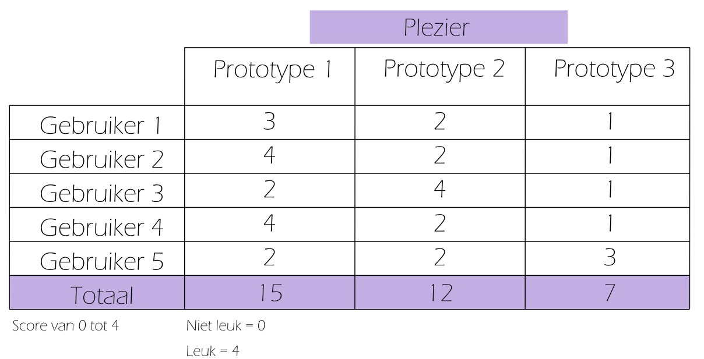

# Intelight
*Het combineren van fysieke activiteit en cognitieve stimulatie die zowel het lichaam als de hersenen versterkt, wat helpt om geheugenverlies preventief tegen te gaan.*

*Projectteam: De Waele Briek; De Croo Nand*

08/01/2025
## Samenvatting
Veel mensen ervaren bij henzelf of rondom hen mentale achteruitgang naarmate ze ouder worden. Hierdoor ontstaan geheugenproblemen en een verminderende cognitieve functie. Aan de hand van literatuurstudie en interviews zijn we dit gaan onderzoeken. Onze conclusie is dat het noodzakelijk is om tijdig preventieve maatregelen te gaan nemen om zo de hersenen actief te houden en geheugenverlies te vertragen. Een manier om dit te bereiken, is door het trainen van het geheugen met cognitieve oefeningen.  

De cognitieve oefening hiervoor is Intelight, een slimme console die gebruikers helpt hun geheugen te trainen door middel van interactieve kleurcombinatiespelletjes. De console stimuleert hersentraining waardoor het brein actief blijft en biedt verschillende denkoefeningen met verschillende moeilijkheidsniveaus, wat de doelgroep doet uitbreiden. Deze oplossing wordt ontwikkeld door middel van verschillende gebruikerstests uit de 2 waves van het eerste semester. Voordat deze tests plaatsvinden, worden prototypes ontworpen op basis van de voorafgaande onderzoeken. 

## Introductie
Het project is vetrokken uit de design challenge “Healty aging”, waarbij het ontwerpen van slimme producten die zorgen voor het gezond verouderen centraal staat.  

Doordat de bevolking steeds ouder wordt, neemt ook het aantal dementerenden toe ([1](https://github.com/nanddecroo/UCD/blob/main/README.md#L168)). Met dit probleem werd in dit project aan de slag gegaan om dit zo veel mogelijk te gaan beperken. Het project is gebaseerd op het onthouden van één of meerdere combinaties.

Hierbij wordt als combinatie kleuren gebruikt. Die kleuren worden getoond d.m.v. een scherm. Na de combinatie gezien te hebben moet de combinatie correct worden ingegeven d.m.v. gekleurde knoppen. De cognitieve oefening kan gespeeld worden op verschillende niveaus. Zo kan er gevarieerd worden met de visualisatie van de kleurencombinatie. De duur van elke kleur kan zo korter/langer zichtbaar gemaakt worden, of ze kiezen de duur door zelf het scherm te besturen. Ook kan er met de knoppen gevarieerd worden. Deze kunnen op voorhand of slechts een beperkte tijd zichtbaar zijn. Ook het aantal kleuren (= aantal knoppen) kan aangepast worden aan de gebruiker. Deze parameters zorgen ervoor dat elke gebruiker met deze cognitieve oefening wordt uitgedaagd. 

Door deze kleurcombinaties te gaan onthouden wordt het werkgeheugen en de visuele perceptie getraind en actief gehouden. Dit veroorzaakt de vertraging van de cognitieve achteruitgang van het brein. De belangrijkste randvoorwaarden hierbij zijn: 

* Gebruiksvriendelijk 
* Vermakelijk 
* Aanpasbaar niveau 
* Veiligheid 
## Methodologie
Als weergave van de methodologie werd de methode van de ‘Double Diamond’ toegepast. Deze methode bestaat uit 4 fasen die hieronder worden uitgelegd. 

__Fase 1__

Het project begon met de keuze van design challenge, dat uiteindelijk ‘Healty Aging’ werd. Om meer te weten over dit onderwerp werd research gedaan naar de problemen bij de gekozen doelgroep. Ook werd meer kennis opgedaan door interviews, met zowel de gebruiker als met 2 ervaringsdeskundigen, en een literatuurstudie. Hierdoor kon men ideeën ontwikkelen en divergerend gaan brainstormen. 

__Fase 2__

In deze fase is het de bedoeling dat er een tijdelijk concept bedacht wordt door de eerder bedachte concepten (fase 1) te gaan convergeren. Die wordt dan gepresenteerd d.m.v. een pitch 

__Fase 3__

Na de pitch werd een team samengesteld en werd voor het gekozen concept gebrainstormd en ging men opnieuw gaan divergeren. Hiervoor werden in 2 waves verschillende prototypes gemaakt die vervolgens getest werden door de gekozen doelgroep (N=5).  

__Fase 4__

Door de testen werden probleempunten duidelijk en konden conclusies getrokken worden.  Hierdoor kon men gaan convergeren naar 1 idee die wordt voorgesteld in het storyboard. Deze fase eindigt met de presentatie.

## 1.1 Discovery
### Doestellingen
Een belangrijke doelstelling was het bestuderen van het probleem, d.m.v. interviews en literatuur, om zo zich te hebben op het probleem en een oplossing te gaan bedenken. Wat ook een doelstelling was, was het convergeren van de verschillende concepten naar 1 gekozen concept. Dit werd bekomen door de concepten te gaan uitwerken d.m.v. prototypes. Vervolgens werden deze prototypes in contact gebracht met de doelgroep van dit project. Zo kon het gedrag van de gebruiker onderzocht worden, wat ook een doelstelling was dit semester.  
### Materiaal & methoden
De gebruikte methodes waren: 

* Interview met ervaringsdeskundige 

* Literatuurstudie
### Resultaten
__Interview met ervaringsdeskundige (N= 3)__

Er werden interviews afgenomen met een ervaringsdeskundigen die diepgaande kennis heeft over de motoriek en het samenwerken van hersenhelften, om die zo te gaan stimuleren. Die expertise was handig om de context verder te verduidelijken en de informatie uit de interviews met de doelgroep te verrijken en te onderbouwen. 

__Literatuurstudie (N= 10)__ 

Aan de hand van literatuurstudie werd onderzocht welke activiteiten een impact hebben op cognitie. Er werd onderzoek gedaan naar de Ronnie Gardiner Methode, maar ook naar de effecten van muziek, fysieke en cognitieve oefeningen op de hersenen. 
### Conclusies & implicaties
Definieer de belangrijkste designbeslissingen

Uit de literatuurstudie blijkt dat door muziek, fysieke en cognitieve oefeningen te combineren worden de hersenen gestimuleerd in verschillende gebieden. Ook groepsactiviteiten hebben een positief effect, het zorgt voor een sociale verbondenheid en een vermindering van stress.

Uit de interviews leiden we af dat combinaties onthouden en reactie vermogen positieve reacties krijgt. Door dit te combineren met een fysieke beweging krijg je een goede oefening die de hersenen stimuleren in verschillende gebieden. Het is ook belangrijk dat het product eenvoudig te gebruiken is, zeker als de gebruiker op leeftijd is.
## 1.2 Definition
Tijdens de definitiefase onderzoeken en evalueren we mogelijke oplossingen om zo tot een concept te komen. 
### Doestellingen
* Storyboard 
* Quick-and-dirty prototypes 
* Concept bekomen 
* Concept valideren 
### Materiaal & methoden
* Prototypes uit hout 
* Prototypes uit karton 
* Digitale interface 
* Gebruikerstesten 
* Gebruikersinterviews 
### Resultaten
Aan de hand van gebruikerstesten kunnen we onze concepten evalueren. Dit doen we met gebruikers uit de doelgroep die we voor ogen hebben. Op deze manier kunnen we tijdens de interactie problemen of moeilijkheden observeren. 

__WAVE 1__ 

Ons doel bij de eerste gebruikerstest is om het concept te valideren. Na een korte introductie stellen we de drie prototypes voor. Bij elk van de drie prototypes is het concept een klein beetje anders. De prototypes werden dan in een willekeurige volgorde uitgetest. Na de testen werd de gebruiker geïnterviewd. Alle data zijn digitaal bijgehouden. 

    

Na de testen werden de interviews geanalyseerd. Tijdens de analyse werden drie scoringsmatrices opgesteld. Er kon een score van 0 tot en met +4 gegeven worden. Aan de hand van de totaalscores zien we welk prototype op welke categorie het best scoort. 

  

__WAVE 2__

Uit de eerste gebruikerstest konden we een concept selecteren om op verder te bouwen. Er werden drie prototypes bedacht en uitgewerkt. Tijdens deze gebruikerstest focussen we ons op de interactie met het prototype. In het tweede semester willen we ons richten op het ontwerpen van de interface. De interactie tussen de gebruiker en het prototype varieert bij elk prototype. Knoppen die al dan niet zichtbaar zijn, de combinatie die op een vaste of een zelf-regelbare snelheid afspeelt. We zijn op dezelfde manier te werk gegaan als tijdens de eerste gebruikerstest. Eerst de prototypes laten uittesten, daarna de gebruiker interviewen en achteraf analyseren. Voor bepaalde criteria werden weer scoringsmatrices opgesteld.  

 
  
  

FOTO PRTOTOTYPE/TESTEN 

### Conclusies & implicaties
Uit de gebruikerstesten en gebruikersinterviews konden een paar conclusies en implicaties getrokken worden. Deze staan hieronder opgesomd. 

__1. Variëteit van de doelgroep__

Zowel de leeftijd als ook de capaciteiten van de doelgroep zijn heel verschillend. Hierdoor is het belangrijk dat er verschillende moeilijkheidsniveaus zijn zodat elke gebruiker mentaal getraind kan worden. Het prototype waarbij enkel de plaats en volgorde van de opgelichte cirkel moest onthouden worden (uit wave 1) was voor de meesten te makkelijk. Het prototype waarbij men de taak kreeg om zowel de volgorde van de kleuren als de kleuren van de knoppen te onthouden was voor de meesten dan weer te moeilijk. In het 2e semester moet hierin een evenwicht gevonden worden. 

__2. Technologisch aspect van het ontwerp__

Bij het prototype waarbij men zelf op het scherm ging tikken om zo de snelheid van de kleurencombinatie aan te passen, kon er geconcludeerd worden dat dit vaak voor moeilijkheden zorgde. Dit kan eventueel opgelost worden door het scherm te besturen met knoppen, i.p.v. het tikken op het scherm. 

__3. Moeilijkheden drukknop__

Na het zien van de kleurenvolgorde bij de test met het scherm en de 4 knoppen (uit wave 1) is het de bedoeling dat de kleurencombinatie gaat ingeven waarbij elke knop staat voor een kleur, visueel zichtbaar gemaakt door de latjes die erboven werden geplaatst. Dit zorgde voor verwarring, aangezien ze niet op de knoppen drukten maar op de kleuren van de latjes. Hier werd rekening mee gehouden in wave 2 waarbij de kleuren op de knoppen stonden. 

__4. Verwarring door aftellen__

Voordat de kleurencode op het scherm getoond werd, werd er eerst afgeteld. Voor sommige testers was dit onduidelijk, aangezien ze het idee hadden dat ze de cijfers moesten onthouden i.p.v. de kleurenvolgorde. Dit zorgde voor verwarring. In plaats van het aftellen bijvoorbeeld kan een balk gebruikt worden die van 0 naar 100% gaat in het tweede semester. 

__5. Timing__

Wat verwarrend was voor sommige testers in wave 1 bij het prototype met het scherm en de knoppen, was de timing van het ingeven van de kleurencombinatie. Zo drukten testers de knoppen al in voordat de kleurencombinatie volledig getoond was. Hier werd op ingegaan bij de 2e wave waarbij de knoppen pas na de combinatie zichtbaar werden. Dit had een positieve invloed op de testen. 

__6. Keuze van concept__

Uit wave 1 kon geconcludeerd worden dat het prototype met het scherm en de 4 knoppen waarbij de kleurencombinatie onthouden moest worden het meest in de smaak viel bij de testers. Daar werd op ingegaan in wave 2. Ook de prototypes, die zijn gemaakt door het divergeren van het gekozen concept van wave 2, werden door 4 van de 5 testers goedgekeurd. Op deze concept wordt dus verdergegaan in het tweede semester.

## Bill of materials
- Welk
- Materiaal
- Heb
- Je
- Nu
- Nodig
- Voor
- Je
- Prototype

## Kritische reflectie
In dit project, bestaande uit twee teamleden, hebben we gewerkt aan de ontwikkeling van een product die hersenen gaan stimuleren, voor de achteruitgang van ouderen af te remmen. Om de loop van het project te gaan evalueren worden verschillende aspecten kritisch gereflecteerd. 

__Positieve aspecten__ 

1. Teamwork

   De samenwerking tussen de 2 leden van dit project verliep heel goed. Er werd naar elkaars ideeën geluisterd en zaten heel vaak op dezelfde golflengte. 

2. Documentatie

   Alle gegevens in die loop van dit 1e semester werden verzameld, werden goed bijgehouden wat een positieve invloed had op de documentatie van dit project. 

3. Feedback van de doelgroep

   Tijdens en na het testen werd er (al dan niet na vragen) veel feedback gegeven over het concept en de prototypes zelf. Hier werd goed op in gegaan waardoor we meer te weten kwamen over de testers. 

4. Snel oplossingen

   Na het reflecteren van de eerste testen werd er goed samengewerkt en gebrainstormd om nieuwe prototypes samen te stellen. Dit verliep heel vlot en zorgde voor een goede samenwerking. 

__Negatieve aspecten/werkpunten__ 
1. Tijdbeheer

   Door afhankelijk te zijn van verschillende factoren zoals: de samenwerking met het rusthuis voor de testen uit te voeren, elkaar en de toetsen/taken/examens van andere vakken werd de tijd vaak onze vijand. 
   Dit  zorgde ervoor dat sommige delen van dit project slechts net op tijd klaar geraakten. Aan de groepsleden om in het tweede semester aan het tijdsbeheer te werken. 

2. Diversiteit van de doelgroep

   De meningen van de testers liepen vaak uiteen. Zo waren de voorkeuren van prototypes verschillend. Doordat er slechts 5 testers per wave waren, maakte dit de keuze nog moeilijker. Desondanks deze 
   moeilijkheden  kon toch een prototype naar voor worden geschoven om aan verder te werken in de verdere loop van dit project. 

4. Duidelijkheid van het prototype

   Sommige prototypes waren niet duidelijk. Zo werd met kleur gewerkt, waarbij 2 kleuren op elkaar leken. Dit maakte het voor de gebruiker moeilijker ondanks dit niet de bedoeling was. Dit voorval had een     
   negatief effect op de testen. 

__Conclusie__ 

Tot nu toe liep het project vlot. Zo zit de samenwerking goed, de feedback van de doelgroep is positief en ook de documentatie is in orde. Ondanks dit alles, werd in het eerste semester toch met de tijd geworsteld. De diversiteit van de doelgroep en de duidelijkheid van de prototypes konden beter. Een groter aantal testers zou een positief effect op ons project gehad hebben. Nu is het aan de groepsleden om de positieve aspecten aan te houden en aan de negatieve aspecten te werken in het tweede semester. 
## Bronnen

1. Corrada, M. M., Brookmeyer, R., Paganini‐Hill, A., Berlau, D., & Kawas, C. H. (2009). Dementia incidence continues to increase with age in the oldest old: The 90+ study. Annals Of Neurology

## Bijlagen
__Soryboard__

__Persona__

__Discovery__
* __Literatuuronderzoek__
  * [Protocol](https://ugentbe-my.sharepoint.com/:w:/g/personal/nand_decroo_ugent_be/EQO5ojILUhpAvYdhQs5gqDYBsdjP-rOHDWYg51mH7GlOow?e=6d7VBJ)
  * [Rapport](https://ugentbe-my.sharepoint.com/:w:/g/personal/nand_decroo_ugent_be/ER4nJUiCkOtConL68cadCsgBBR-UiJlHnRMlCM_Cl6AXbQ?e=wm2MFH)
* __Interview__
  * [Protocol](https://ugentbe-my.sharepoint.com/:w:/g/personal/nand_decroo_ugent_be/EbDdueQYRsFEp-3c0Lc8U9IBAZy17bBKNqHP2-ao8GOVgg?e=LDE5yt)
  * [Rapport](https://ugentbe-my.sharepoint.com/:w:/g/personal/nand_decroo_ugent_be/EUAGYqYv4BZKow6MQDt2m_sBL42e95z8hOtlYqybAQRS-Q?e=eaTqn9)
  * [Informed Consent](https://ugentbe-my.sharepoint.com/:w:/g/personal/nand_decroo_ugent_be/EVc9HSN4QXlMqAPy4dVvViIBcxVU0onC3P6XKRvjQf-UfQ?e=MHBypZ)

__Definition__
* __Wave 1 gebruikerstesten__
  * [Protocol](https://ugentbe-my.sharepoint.com/:w:/g/personal/nand_decroo_ugent_be/Eb980PCmLEBCnWNDjG_flh8BfeC5139l5l0VIOIjY3vm0g?e=roBAXN)
  * [Rapport](https://ugentbe-my.sharepoint.com/:w:/g/personal/nand_decroo_ugent_be/EWpgg5un1oVDny0ijt7-1XgBJvvFsVy6mcjcF40fSneS1g?e=kaXiP6)
  * [Informed Consent](https://ugentbe-my.sharepoint.com/:w:/g/personal/nand_decroo_ugent_be/EdSriIjsqNBFpWl6v9d3dGMBsB7fI7kc8Qbja1BooHT7Kg?e=hbgTDS)
* __Wave 2 gebruikerstesten__
  * [Protocol](https://ugentbe-my.sharepoint.com/:w:/g/personal/nand_decroo_ugent_be/EZ0a0e4UxSNAnWVUYQDnIiQB5WDNmhABZjaIjHXAPcsrmA?e=a14Cu0)
  * [Rapport](https://ugentbe-my.sharepoint.com/:w:/g/personal/nand_decroo_ugent_be/EZt7PyPyn0JHvj6A8d-wA8UBd1ZW62XhCz2g48GQjEiyYw?e=b9FzAo)
  * [Informed Consent](https://ugentbe-my.sharepoint.com/:w:/g/personal/nand_decroo_ugent_be/EU2_0dEthc5DjmyXs7uG1icBKKj7tkdiknNRASXVH-6iDg?e=hdaQ1v)
